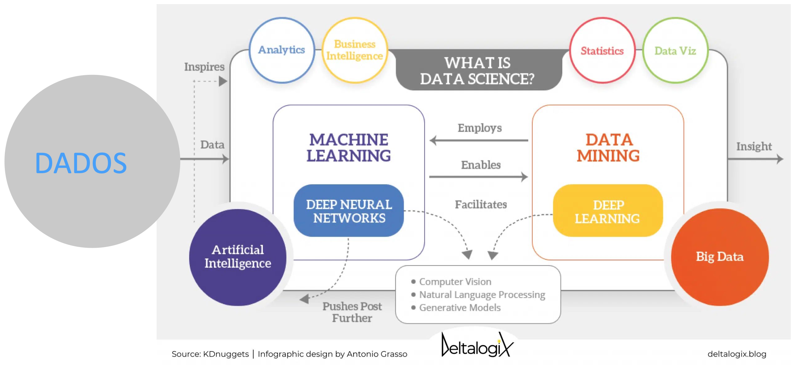
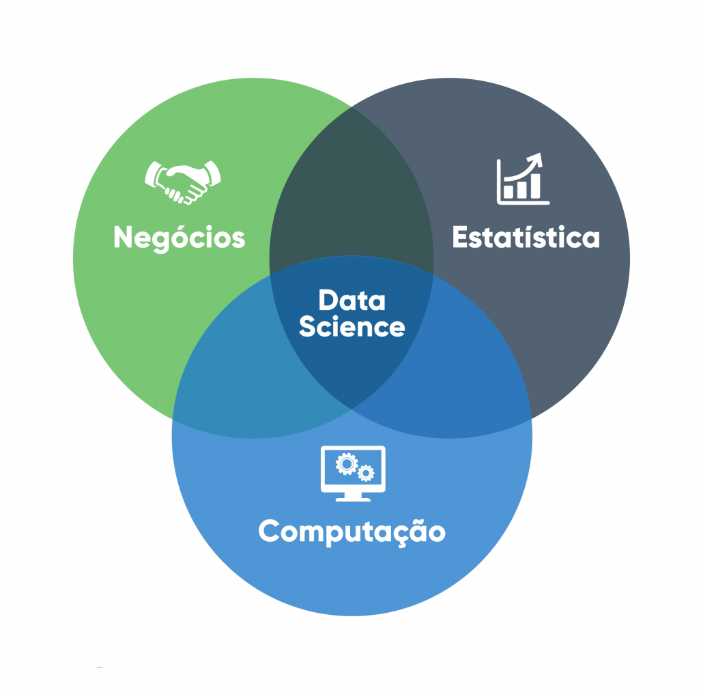

# Introdução à Ciência de Dados e Inteligência Artificial

Faça o download do pdf de Introdução.
> - arquivo pdf: [Introdução](slides.pdf)

## O que é Ciência de Dados?

Você já se perguntou como a Netflix sempre sabe qual filme você vai querer assistir? Ou como o seu banco detecta uma compra suspeita no seu cartão em segundos? A resposta está na **Ciência de Dados**!

A **Ciência de Dados** é um campo interdisciplinar que utiliza métodos científicos, processos, algoritmos e sistemas para `extrair conhecimento` e insights valiosos de dados estruturados e não estruturados. É evolução natural da estatística tradicional, só que com programação, matemática e conhecimento específico para resolver problemas complexos do mundo real.

!!! tip
      "Ciência de Dados é o campo que combina estatística, análise de dados, machine learning e métodos relacionados para entender e analisar fenômenos reais através de dados." https://dl.acm.org/doi/pdf/10.1145/2500499 *Dhar, 2013*

### Componentes Fundamentais da Ciência de Dados

A Ciência de Dados pode ser compreendida como a convergência de três conjuntos de competências essenciais, cuja integração é indispensável para a prática profissional eficaz:

1. **Habilidades de Programação** Competência para manipulação, processamento e análise de dados por meio de linguagens e ferramentas computacionais, possibilitando a implementação de algoritmos e a automação de tarefas analíticas.
2. **Conhecimento Matemático e Estatístico** Fundamentação teórica para modelagem, inferência e interpretação de dados, abrangendo conceitos como probabilidade, estatística descritiva e inferencial, álgebra linear e análise de algoritmos.
3. **Expertise de Domínio** Compreensão aprofundada do contexto específico em que o problema está inserido, permitindo a formulação de hipóteses realistas, a correta interpretação dos resultados e a tomada de decisões embasadas.

!!! tip
      **Dica importante**: Embora não seja necessário dominar todas as áreas desde o início, a atuação consistente em Ciência de Dados requer o desenvolvimento progressivo e equilibrado dessas competências, com aprofundamento gradual de acordo com o foco profissional ou acadêmico.

<?quiz?>
question: Por que a Ciência de Dados precisa dos três componentes (programação, matemática e conhecimento de domínio)?
answer: Para impressionar os chefes com termos técnicos
answer-correct: Porque cada um resolve uma parte específica do problema de forma complementar
answer: Porque assim o salário fica mais alto
answer: Na verdade, só a programação é importante
content:

Exato! Programação te dá as ferramentas, matemática/estatística te dá os métodos corretos, e conhecimento de domínio garante que você está resolvendo o problema certo da forma certa. É como um tripé - tire uma perna e tudo desaba!
<?/quiz?>

## História e Evolução da Ciência de Dados

A Ciência de Dados é resultado de um processo evolutivo que integra estatística, ciência da computação e conhecimento de domínio, impulsionado por avanços tecnológicos e pela crescente disponibilidade de dados em larga escala.

### Marcos Históricos

- **1962**: O estatístico John W. Tukey, em seu artigo "The Future of Data Analysis", propôs uma abordagem mais abrangente para a análise de dados, antecipando a integração entre estatística e métodos computacionais. Embora não tenha utilizado diretamente o termo Data Science, sua visão foi precursora.

- **1970s-1980s**: A criação do modelo relacional por Edgar F. Codd (1970) e a popularização dos sistemas de gerenciamento de bancos de dados relacionais (SGBDR) transformaram a forma de armazenar e consultar dados.
- **1990s**: O termo Data Mining ganhou destaque, descrevendo técnicas para extração de padrões de grandes conjuntos de dados. Paralelamente, algoritmos de aprendizado de máquina, como árvores de decisão, redes neurais artificiais e métodos de vizinhança, começaram a ser aplicados de forma mais ampla (essas técnicas já existiam antes) em cenários comerciais.
- **2001**: William S. Cleveland em seu trabalho "Data Science: An Action Plan for Expanding the Technical Areas of the Field of Statistics", propôs ampliar o escopo da estatística para incluir computação, visualização de dados e aplicações multidisciplinares, formalizando parte da base conceitual da Ciência de Dados.
- **2008**: DJ Patil (LinkedIn) e Jeff Hammerbacher (Facebook) são frequentemente creditados por popularizar o termo Data Scientist para descrever um profissional com competências em programação, estatística e entendimento de negócios.
- **2010s**: Explosão do Big Data! Com o crescimento exponencial da geração de dados, tecnologias como Hadoop e Spark possibilitaram o processamento distribuído em larga escala. A quantidade de dados gerada globalmente passou a crescer de forma acelerada, superando rapidamente a capacidade de armazenamento e processamento tradicionais.
- **2020s**: Democratização da IA e MLOps com ferramentas de inteligência artificial de código aberto e serviços baseados em nuvem tornaram o acesso à IA mais acessível. O MLOps consolidou-se como disciplina para integrar modelos de machine learning ao ciclo de desenvolvimento e operação de sistemas.

<?quiz?>
question: O que diferencia a Ciência de Dados da Estatística tradicional?
answer: Ciência de Dados usa apenas dados digitais
answer: Estatística não usa computadores
answer-correct: Ciência de Dados combina programação, estatística e conhecimento de domínio para trabalhar com big data
answer: Não há diferença entre elas
content:

A Ciência de Dados é interdisciplinar, combinando estatística com programação e conhecimento específico do domínio para extrair insights de grandes volumes de dados estruturados e não estruturados.
<?/quiz?>

## Tipos de Dados em Ciência de Dados

Nem todo dado é igual! Cada tipo tem suas características e requer técnicas específicas de preparação. Vamos conhecer os três principais:

### 1. Dados Estruturados
São os "certinhos" da turma! Organizados em formato tabular com linhas e colunas bem definidas, como uma planilha Excel bem organizada.

**Exemplos práticos:**
- Planilhas Excel (vendas mensais, cadastro de clientes)
- Bancos de dados relacionais (SQL) - como o sistema de uma loja online
- Arquivos CSV - formato universal de troca de dados
- Dados de sensores IoT com schema fixo (temperatura, umidade, pressão)

**Vantagem**: Fáceis de analisar e processar
**Desvantagem**: Representam apenas uma pequena parte dos dados do mundo real (cerca de 20%)

### 2. Dados Semi-estruturados
Os "meio organizados"! Não seguem um formato rígido de tabela, mas possuem alguma organização que podemos aproveitar.

**Exemplos práticos:**
- JSON (JavaScript Object Notation) - usado em APIs web
- XML (eXtensible Markup Language) - comum em sistemas antigos
- Logs de sistemas - rastros digitais de aplicações
- Emails com metadados (remetente, data, assunto)

**Vantagem**: Mais flexíveis que dados estruturados
**Desvantagem**: Precisam de algum processamento antes da análise

### 3. Dados Não-estruturados
Os "brabosssss"! Sem organização predefinida que requerem técnicas especiais de processamento. São a maioria absoluta dos dados no mundo digital!

**Exemplos práticos:**
- Textos livres (artigos, posts no Twitter, reviews de produtos)
- Imagens e vídeos (fotos do Instagram, vídeos do YouTube)
- Áudios e podcasts (gravações de call center, música)
- Documentos PDF (contratos, relatórios, livros)

**Vantagem**: Contêm informações riquíssimas e insights únicos
**Desvantagem**: Requerem técnicas avançadas (NLP, Computer Vision) para análise

<?quiz?>
question: Qual tipo de dados requer maior processamento para análise?
answer: Dados estruturados
answer: Dados semi-estruturados
answer-correct: Dados não-estruturados
answer: Todos requerem o mesmo nível de processamento
content:

Dados não-estruturados como textos, imagens e áudios requerem técnicas especiais de processamento (NLP, Computer Vision, etc.) antes de poderem ser analisados, ao contrário de dados estruturados que já estão em formato tabular.
<?/quiz?>
