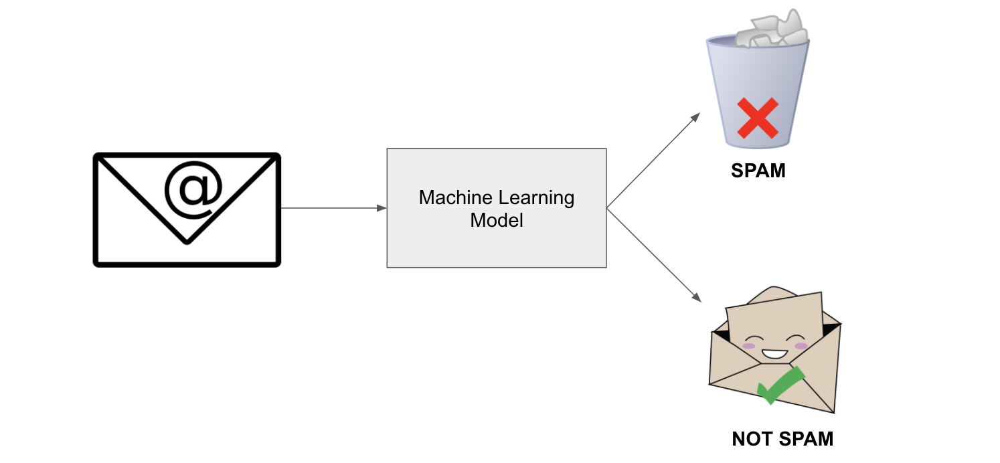
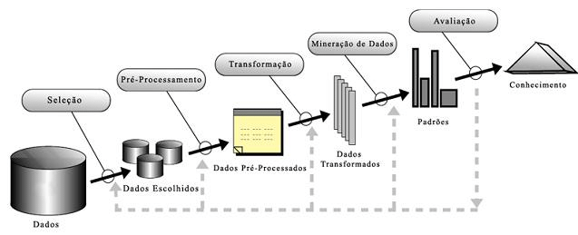
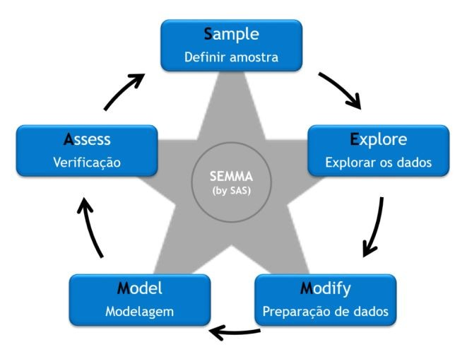
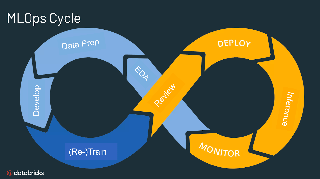

## Descoberta do conhecimento

Imagine que você tem uma montanha de dados na sua empresa e precisa transformá-los em decisões inteligentes. Como fazer isso de forma organizada e eficiente? É exatamente isso que vamos descobrir!

Vamos começar essa etapa do nosso curso explorando o ciclo de vida de dados em projetos de ciência de dados - um roteiro que todo cientista de dados segue para extrair conhecimento valioso dos dados.

!!! info
    A descoberta do conhecimento é um conjunto estruturado de etapas que nos permite transformar grandes volumes de dados brutos em informações úteis e compreensíveis.

### Introdução ao CRISP-DM

O CRISP-DM (Cross-Industry Standard Process for Data Mining) é uma ferramenta amplamente utilizada na indústria para projetos de ciência de dados.

Repare que o processo é cíclico - isso significa que podemos voltar a etapas anteriores conforme descobrimos novos `insights`!

<?quiz?>
question: Por que o CRISP-DM é representado como um processo cíclico e não linear?
answer: Porque os dados sempre mudam com o tempo
answer-correct: Porque podemos descobrir novos insights que nos fazem repensar etapas anteriores
answer: Porque é mais bonito visualmente
answer: Porque sempre precisamos começar do zero
content:

Exato! O processo é iterativo porque conforme avançamos, podemos descobrir que precisamos coletar mais dados, redefinir o problema ou ajustar nossa abordagem. É um processo de aprendizado contínuo!
<?/quiz?>

### 1. Entendimento do Negócio

!!! tip
    **"Antes de resolver um problema, certifique-se de que está resolvendo o problema certo!"**

O primeiro passo é como ser um detetive: você precisa investigar e entender completamente o "crime" (problema) que precisa resolver. Muitos projetos falham porque pulam esta etapa crucial!

Imagine que você trabalha em uma loja online e o gerente diz: "Queremos usar IA para aumentar as vendas". Parece claro, né? Mas não é! Você precisa descobrir:
- As vendas estão baixas em quais produtos específicos?
- O problema é atrair novos clientes ou fazer os existentes comprarem mais?
- Qual é o orçamento disponível?
- Em quanto tempo precisam ver resultados?

#### Perguntas-Chave desta Fase
- Qual é o problema de negócio que estamos tentando resolver?
- Como o sucesso será medido?
- Quais são as restrições de tempo, orçamento e recursos?
- Como os resultados serão implementados?

<?quiz?>
question: Um gerente pede para "usar machine learning para melhorar o atendimento ao cliente". O que você deveria perguntar primeiro?
answer: Quais algoritmos ele prefere usar
answer: Quantos dados históricos temos disponíveis
answer-correct: Como exatamente ele define "melhorar o atendimento" e como vamos medir essa melhoria
answer: Qual é o orçamento do projeto
content:

Perfeito! Sem definir claramente o que significa "melhorar" e como medir isso, você pode acabar resolvendo o problema errado. Pode ser reduzir tempo de espera, aumentar satisfação, reduzir reclamações... cada um requer uma abordagem diferente!
<?/quiz?>

#### Ferramentas e Técnicas
- **Entrevistas e Workshops**: Para coletar informações dos stakeholders e especialistas
- **Mapas Mentais**: Para visualizar o problema e suas possíveis soluções
- **5W2H**: Framework para definir escopo (What, Why, Who, When, Where, How, How much)

### 2. Entendimento dos Dados

Agora que você sabe qual problema resolver, é hora de conhecer seus os dados! Esta fase é como explorar uma nova cidade: você precisa conhecer o território antes de planejar seu roteiro.

!!! tip
    Dados ruins produzem modelos ruins, não importa quão sofisticado seja seu algoritmo! É como tentar fazer um bolo delicioso com ingredientes estragados.

#### Atividades Principais
- **Coleta Inicial**: Reunir todos os dados disponíveis (como fazer um inventário da sua cozinha)
- **Descrição dos Dados**: Documentar estrutura, formato e significado (criar um catálogo dos ingredientes)
- **Exploração**: Análise estatística descritiva inicial (provar os ingredientes)
- **Verificação de Qualidade**: Identificar problemas nos dados (verificar se estão frescos)

#### Ferramentas e Técnicas
- **SQL e NoSQL**: Para coleta de dados de bases estruturadas e não estruturadas
- **Exploração de Dados**: Usando pandas, matplotlib e seaborn para análise exploratória (EDA)
- **Análise de Qualidade**: Verificação de inconsistências, valores ausentes e outliers
- **Profiling de Dados**: Ferramentas automatizadas para gerar relatórios de qualidade

<?quiz?>
question: Durante a exploração inicial dos dados de vendas de uma empresa, você descobre que 30% dos registros têm valores ausentes na coluna "idade do cliente". Qual deve ser sua primeira ação?
answer: Excluir imediatamente todos os registros com dados ausentes
answer: Preencher com a média de idade de todos os clientes
answer-correct: Investigar por que esses dados estão ausentes e se há um padrão
answer: Ignorar a coluna idade completamente
content:

Correto! Primeiro você precisa entender o "porquê" dos dados ausentes. Talvez clientes de certas regiões não informem idade, ou o sistema teve problemas em períodos específicos. Essa investigação pode revelar insights importantes!
<?/quiz?>

### 3. Preparação dos Dados

Chegamos à fase que consome 70-80% do tempo de qualquer projeto de ciência de dados! É trabalhoso, mas essencial para o sucesso.

**Realidade check**: Se você acha que ciência de dados é só treinar modelos sofisticados, prepare-se para uma surpresa! A maior parte do tempo você será um "faxineiro de dados" - e isso é perfeitamente normal e necessário.

#### Atividades Detalhadas
- **Limpeza**: Remoção de duplicatas, correção de inconsistências
- **Integração**: Combinação de dados de múltiplas fontes (como juntar ingredientes de fornecedores diferentes)
- **Transformação**: Normalização, padronização, discretização
- **Redução**: Seleção de features e redução de dimensionalidade
- **Construção**: Feature engineering - criar novas variáveis que ajudem o modelo

#### Ferramentas e Técnicas
- **Pandas e NumPy**: Para manipulação e transformação de dados
- **Scikit-learn**: Para pré-processamento como normalização e codificação
- **Feature Engineering**: Criação de novas features (a parte mais criativa!)
- **Pipelines**: Automatização do processo de preparação

### 4. Modelagem

Aqui é onde a mágica acontece e você aplica algoritmos de machine learning aos seus dados preparados.

!!! tip
    **Importante**: Não existe um algoritmo `melhor` para todos os problemas. É como escolher uma ferramenta, você usaria um martelo para apertar um parafuso?

#### Tipos de Problemas e Técnicas

**Problemas Supervisionados** (quando você tem as "respostas corretas" para treinar):
- **Classificação**: Prever categorias (spam ou não spam, gato ou cachorro)
  - Árvores de Decisão, Random Forest, SVM, Redes Neurais
- **Regressão**: Prever valores numéricos (preço de casa, vendas do próximo mês)
  - Regressão Linear, Ridge, Lasso, XGBoost

**Problemas Não-Supervisionados** (quando você explora sem "respostas" pré-definidas):
- **Clustering**: Agrupar dados similares (segmentar clientes)
  - K-Means, Hierarchical Clustering, DBSCAN
- **Redução de Dimensionalidade**: Simplificar dados complexos
  - PCA, t-SNE, UMAP

<?quiz?>
question: Você precisa prever se um e-mail é spam ou não. Que tipo de problema é este?
answer: Regressão, porque queremos um valor numérico
answer-correct: Classificação, porque queremos categorizar em duas classes
answer: Clustering, porque queremos agrupar e-mails similares
answer: Redução de dimensionalidade, porque temos muitas palavras
content:

Perfeito! É um problema de classificação binária pois queremos classificar cada e-mail em uma de duas categorias: spam ou não spam. O resultado é uma categoria, não um valor numérico.
<?/quiz?>

#### Ferramentas e Técnicas
- **Scikit-learn**: Para algoritmos tradicionais de machine learning
- **TensorFlow/Keras e PyTorch**: Para redes neurais profundas
- **Cross-validation**: Para avaliar modelos de forma robusta
- **Grid Search**: Para encontrar os melhores parâmetros

### 5. Avaliação

!!! tip
    **"Um modelo que parece bom no papel pode ser um desastre na vida real!"**

É importante validar se o modelo realmente resolve o problema de negócio. Esta fase de avaliação vai além de olhar métricas técnicas.

#### Métricas de Avaliação por Tipo de Problema

**Classificação:**
- **Accuracy**: Quantos acertei do total (cuidado com dados desbalanceados!)
- **Precision**: Dos que previ como positivos, quantos realmente eram?
- **Recall**: Dos positivos reais, quantos consegui encontrar?
- **F1-Score**: Harmonia entre precision e recall

**Regressão:**
- **RMSE**: Quão longe, em média, minhas previsões estão da realidade?
- **MAE**: Erro médio absoluto (mais fácil de interpretar)
- **R²**: Quanto da variação consigo explicar? (0-100%)

<?quiz?>
question: Você criou um modelo para detectar fraudes bancárias. O modelo tem 99% de accuracy, mas detecta apenas 10% das fraudes reais. Qual é o problema principal?
answer: O modelo está overfittado
answer: Precisamos de mais dados de treino
answer-correct: O modelo tem baixo recall - está perdendo muitas fraudes reais
answer: A accuracy está muito alta, deve estar errado
content:

Exato! Com dados desbalanceados (poucas fraudes), alta accuracy pode ser enganosa. Se apenas 1% das transações são fraudes, um modelo que sempre diz "não é fraude" teria 99% accuracy, mas seria inútil! O recall baixo indica que estamos perdendo fraudes reais.
<?/quiz?>

#### Ferramentas e Técnicas
- **Métricas de Avaliação**: Precision, recall, F1-score, AUC-ROC
- **Confusion Matrix**: Para análise visual detalhada
- **ROC Curves**: Para avaliar trade-offs entre sensibilidade e especificidade
- **A/B Testing**: Para validação no mundo real
- **Análise de Bias**: Verificação de vieses e fairness

### 6. Implantação

!!! tip
    **"Um modelo que não vai para produção é apenas um hobby caro!"**

Aqui é onde seu modelo sai do laboratório e entra no mundo real.

#### Ferramentas e Técnicas
- **Flask e FastAPI**: Para criar APIs web
- **Docker e Kubernetes**: Para containerização e escalabilidade
- **MLflow**: Para versionar e rastrear modelos
- **Monitoramento**: Prometheus e Grafana para acompanhar performance
- **CI/CD**: Deploy automatizado e seguro

<?quiz?>
question: Seu modelo de recomendação está em produção há 3 meses e a performance começou a cair. Qual é a causa mais provável?
answer: O código do modelo foi corrompido
answer: Os servidores estão sobrecarregados
answer-correct: Os dados mudaram e o modelo precisa ser retreinado
answer: Os usuários pararam de usar o sistema
content:

Correto! Este é um fenômeno comum chamado "model drift". Com o tempo, os padrões nos dados mudam (novos produtos, mudanças no comportamento do usuário), e o modelo fica "desatualizado". É por isso que monitoramento e retreinamento são essenciais!
<?/quiz?>

### Outras estratégias

Embora o CRISP-DM seja o mais popular, existem outras metodologias interessantes:

- **KDD (Knowledge Discovery in Databases)** - O "avô" do CRISP-DM, mais acadêmico

- **SEMMA (Sample, Explore, Modify, Model, Assess)** - Criado pela SAS, focado nas ferramentas

- **MLOps (Machine Learning Operations)** - A evolução moderna, focada em automação e DevOps

<?quiz?>
question: Qual é a primeira fase do CRISP-DM e por que ela é crucial?
answer: Preparação dos Dados - porque dados limpos são essenciais
answer-correct: Entendimento do Negócio - porque define objetivos e critérios de sucesso
answer: Modelagem - porque é onde a IA acontece
answer: Coleta de Dados - porque precisamos de dados para começar
content:

O entendimento do negócio é fundamental porque estabelece o que realmente precisa ser resolvido, como o sucesso será medido e garante que o projeto esteja alinhado com os objetivos organizacionais.
<?/quiz?>

<?quiz?>
question: Uma empresa de e-commerce quer implementar um sistema de recomendação de produtos. Ordene as fases do CRISP-DM que seriam seguidas.
answer-correct: Entendimento do Negócio → Entendimento dos Dados → Preparação dos Dados → Modelagem → Avaliação → Implantação
answer: Preparação dos Dados → Modelagem → Entendimento do Negócio → Avaliação → Entendimento dos Dados → Implantação
answer: Modelagem → Entendimento do Negócio → Preparação dos Dados → Avaliação → Implantação → Entendimento dos Dados
answer: Entendimento dos Dados → Modelagem → Preparação dos Dados → Avaliação → Entendimento do Negócio → Implantação
content:

Correto! Entendimento do Negócio → Entendimento dos Dados → Preparação dos Dados → Modelagem → Avaliação → Implantação
<?/quiz?>

<?quiz?>
question: Você está trabalhando em um projeto de ciência de dados e percebe que está gastando mais tempo preparando dados do que criando modelos. Isso é:
answer: Um sinal de que você está fazendo algo errado
answer: Motivo para pular algumas etapas de limpeza
answer-correct: Completamente normal - preparação de dados consome 70-80% do tempo
answer: Indicação de que os dados são de baixa qualidade
content:

Isso é absolutamente normal! A preparação de dados é a parte mais trabalhosa, mas também mais importante de qualquer projeto. Dados bem preparados são a base para modelos de sucesso. Como dizem: "Garbage in, garbage out!"
<?/quiz?>

