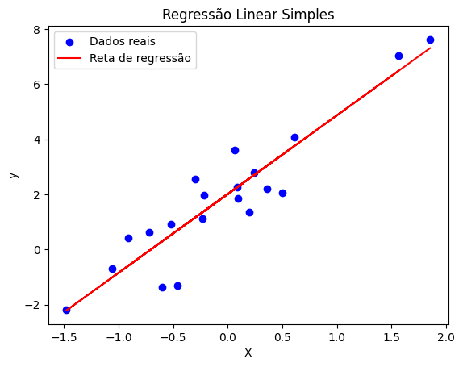

# Regressão em Machine Learning

Nesta aula, vamos explorar os fundamentos de problemas de regressão, entender como modelar relações entre variáveis e aplicar esses conceitos em atividades práticas. Nosso objetivo é aprender a entender o problema a ser resolvido e treinar modelos de forma precisa e eficiente.

### Atividades Práticas
As seguintes atividades foram preparadas para reforçar os conceitos abordados:

- **[Lab 1: Regressão Simples](regressao.ipynb)**  
  Introdução aos conceitos básicos de regressão, com aplicação prática na predição de preços de casas na Califórnia.
- **[Lab 2: Técnicas Avançadas](regressao2.ipynb)**  
  Exploração de métodos como regressão polinomial e XGBoost para modelagem mais robusta.
- **[Lab 3: Predição de Preços de Notebooks](preco-notebook.ipynb)**  
  Treinamento de um modelo para prever o valor de notebooks com base em suas características.

### Datasets
Os laboratórios utilizam os seguintes conjuntos de dados:
- **[Housing](housing.csv)**: Informações sobre casas na Califórnia, usado no Lab 1.
- **[Laptop Data](laptop_data.csv)**: Dados de notebooks, usado no Lab 3.


## O que é regressão?

A regressão é uma técnica de aprendizado supervisionado usada para prever valores numéricos contínuos a partir de variáveis de entrada (features). Em vez de atribuir classes, buscamos estimar quantidades — por exemplo, o preço de um imóvel ou a temperatura amanhã.


### Classificação vs Regressão

| Aspecto | Classificação | Regressão |
|---------|---------------|-----------|
| Saída | Categórica / Discreta | Numérica / Contínua |
| Exemplos | Spam / Sentimento / Tipo de flor | Preço / Temperatura / Altura |
| Métricas | Acurácia, Precisão, Recall | MAE, MSE, RMSE, R² |
| Exemplos de algoritmos | KNN, SVM, Random Forest (class.) | Regressão Linear, Ridge, Lasso, SVR, Árvores/Boosting |


<?quiz?>
question: Qual é a principal diferença entre regressão e classificação?
answer: Regressão prediz categorias; Classificação prediz números
answer: Ambas só funcionam com dados categóricos
answer-correct: Regressão prediz números; Classificação prediz categorias
answer: Classificação é sempre não supervisionada
content:

Regressão estima valores numéricos contínuos (por exemplo, preço), enquanto classificação atribui uma categoria ou rótulo (por exemplo, spam ou não-spam).
<?/quiz?>

## Ideia matemática

Procuramos uma função f que aproxime a relação entre entradas X e alvo y:

```
y = f(X) + ε
```

ε representa o ruído — sempre haverá alguma incerteza.

<?quiz?>
question: O que representa ε na equação y = f(X) + ε ?
answer: Um parâmetro do modelo
answer-correct: O ruído ou erro aleatório
answer: A variável de entrada
content:

ε simboliza o erro aleatório ou ruído que não é explicado pela função f(X); é a parte imprevisível dos dados.
<?/quiz?>


## Principais famílias de modelos

1. Regressão Linear Simples
    - Uma variável explicativa; relação aproximadamente linear: `y = β₀ + β₁x + ε`.

2. Regressão Linear Múltipla
    - Várias features: `y = β₀ + β₁x₁ + β₂x₂ + ... + βₙxₙ + ε`.

3. Regressão Polinomial
    - Quando a relação é não linear, aumentamos a base com potências de x: `y = β₀ + β₁x + β₂x² + ...`.

4. Regressão Regularizada
    - Ridge (L2): penaliza coeficientes grandes — útil quando há multicolinearidade.
    - Lasso (L1): pode zerar coeficientes — ajuda a selecionar features.
    - Elastic Net: combinação L1 + L2.

5. SVR (Support Vector Regression) 
    - Ideal para datasets pequenos/médios com relações não lineares, usando kernels (como RBF) para capturar padrões complexos sem necessidade de features polinomiais.
6. Árvores, Florestas e Boosting
    - Modelos como Random Forest e XGBoost são poderosos para capturar não linearidades e interações entre features. São menos sensíveis a outliers e requerem menos pré-processamento, mas podem ser mais difíceis de interpretar.


<?quiz?>
question: Qual método tende a zerar coeficientes, ajudando na seleção de features?
answer: Ridge
answer-correct: Lasso
answer: Regressão Polinomial
answer: SVR
content:

Lasso (L1) pode reduzir coeficientes a zero, realizando seleção de features; Ridge (L2) encolhe coeficientes sem zerá-los.
<?/quiz?>

## Intuição de Regressão Linear

A regressão linear procura a reta (ou hiperplano) que melhor explica a relação entre X e y, minimizando discrepâncias entre valores reais e previstos.

### Método dos Mínimos Quadrados

Minimizamos a soma dos quadrados dos resíduos:

```
SSR = Σ(yᵢ - ŷᵢ)²
```

Para regressão linear simples, os coeficientes têm fórmulas fechadas úteis para entendimento:

```
β₁ = Σ((xᵢ - x̄)(yᵢ - ȳ)) / Σ((xᵢ - x̄)²)
β₀ = ȳ - β₁x̄
```

### Intuição de Pressupostos Importantes
- **Linearidade**: A relação entre X e y deve parecer uma reta (ou um plano em múltiplas dimensões). Se os dados formam uma curva, regressão linear pode não funcionar bem.
- **Independência**: Cada observação (e.g., preço de uma casa) não deve ser influenciada por outra.
- **Homocedasticidade**: Os erros do modelo (diferença entre valores reais e previstos) devem ter variação constante. Imagine que os pontos estão igualmente espalhados ao redor da reta de regressão.
- **Normalidade dos resíduos**: Os erros devem seguir uma distribuição normal (isso é mais importante para testes estatísticos).
- **Baixa multicolinearidade**: As features não devem ser muito correlacionadas entre si (e.g., se "área da casa" e "número de quartos" são quase idênticas, isso pode confundir o modelo).


<?quiz?>
question: Qual pressuposto implica que os resíduos tenham variância constante?
answer: Linearidade
answer-correct: Homocedasticidade
answer: Normalidade
answer: Independência das observações
content:

Homocedasticidade significa que a variância dos resíduos é aproximadamente constante ao longo das predições; quando isso falha, temos heterocedasticidade.
<?/quiz?>

### Exemplo em Python

```python
from sklearn.linear_model import LinearRegression
from sklearn.model_selection import train_test_split
from sklearn.metrics import mean_squared_error, r2_score
import numpy as np

# Dados sintéticos
np.random.seed(42)
X = np.random.randn(100, 1)
y = 2 + 3 * X.ravel() + np.random.randn(100)

# Treino / teste
X_train, X_test, y_train, y_test = train_test_split(X, y, test_size=0.2, random_state=42)

# Treina
model = LinearRegression()
model.fit(X_train, y_train)

# Prediz
y_pred = model.predict(X_test)

# Avalia
mse = mean_squared_error(y_test, y_pred)
r2 = r2_score(y_test, y_pred)

print(f"Coeficiente: {model.coef_[0]:.2f}")
print(f"Intercepto: {model.intercept_:.2f}")
print(f"MSE: {mse:.2f}")
print(f"R²: {r2:.2f}")
```

Para visualizar o resultado:

```python
import matplotlib.pyplot as plt

# Plot dos dados e da reta de regressão
plt.scatter(X_test, y_test, color='blue', label='Dados reais')
plt.plot(X_test, y_pred, color='red', label='Reta de regressão')
plt.xlabel('X')
plt.ylabel('y')
plt.title('Regressão Linear Simples')
plt.legend()
plt.show()
```



## Métricas de avaliação 

As métricas ajudam a comparar modelos e interpretar a magnitude dos erros.

### MSE (Erro Quadrático Médio)

```
MSE = (1/n) × Σ(yᵢ - ŷᵢ)²
```

Penaliza erros grandes (unidade: quadrado da unidade do target).

### RMSE (Raiz do MSE)

```
RMSE = √MSE
```

Tem a mesma unidade do target e é mais intuitiva que o MSE.

### MAE (Erro Absoluto Médio)

```
MAE = (1/n) × Σ|yᵢ - ŷᵢ|
```

Menos sensível a outliers que o MSE/RMSE.

### R² (Coeficiente de Determinação)

```
R² = 1 - (SSres / SStot)
```

Onde:
- SSres = Σ(yᵢ - ŷᵢ)²
- SStot = Σ(yᵢ - ȳ)²

R² indica a proporção da variância explicada pelo modelo. Valores mais altos são melhores, mas atenção: R² pode ser negativo se o modelo for pior que prever a média.


### Exemplo em Python

```python
from sklearn.metrics import mean_squared_error, mean_absolute_error, r2_score
import numpy as np

# supondo, modelo já treinado e y_true e y_pred 
mse = mean_squared_error(y_true, y_pred)
rmse = np.sqrt(mse)
mae = mean_absolute_error(y_true, y_pred)
r2 = r2_score(y_true, y_pred)

print(f"MSE: {mse:.4f}")
print(f"RMSE: {rmse:.4f}")
print(f"MAE: {mae:.4f}")
print(f"R²: {r2:.4f}")
```

<?quiz?>
question: Qual métrica é menos sensível a outliers?
answer: MSE
answer: RMSE
answer-correct: MAE
answer: R²
content:

MAE (Erro Absoluto Médio) penaliza menos discrepâncias grandes que o MSE/RMSE, sendo mais robusto a outliers.
<?/quiz?>


<!-- Exercício: Ajuste de Parâmetros (Linear Regression) -->
<div id="linreg-widget" style="max-width:980px;margin:1.25rem 0;padding:1rem;border:1px solid var(--md-default-fg-color--lightest,#e0e0e0);border-radius:14px;background:var(--md-default-bg-color,#fff)">
  <h3 style="margin:0 0 .5rem 0">Ajuste w (peso) e b (viés) para minimizar o MSE</h3>

  <div style="display:flex;gap:1rem;flex-wrap:wrap;align-items:flex-end">
    <label style="flex:1 1 260px">
      <div>peso <code>w</code>: <strong><span id="wVal">0.50</span></strong></div>
      <input id="w" type="range" min="-8" max="2" step="0.01" value="-6.5" style="width:100%">
    </label>

    <label style="flex:1 1 260px">
      <div>viés <code>b</code>: <strong><span id="bVal">0.00</span></strong></div>
      <input id="b" type="range" min="-10" max="60" step="0.01" value="46.0" style="width:100%">
    </label>

    <div style="flex:1 1 220px;line-height:1.6">
      <div><strong>MSE</strong>: <span id="mse">—</span></div>
      <div>Equação: <code id="eqn">y = w·x + b</code></div>
      <label style="display:flex;gap:.5rem;align-items:center;margin-top:.25rem;font-size:.95em">
        <input id="resid" type="checkbox"> Mostrar resíduos
      </label>
    </div>

    <div style="flex:1 1 220px;display:flex;gap:.5rem;justify-content:flex-end">
      <button id="btnFit" class="md-button md-button--primary" style="white-space:nowrap">Auto-ajustar (OLS)</button>
      <button id="btnReset" class="md-button" style="white-space:nowrap">Reset</button>
    </div>
  </div>

  <div style="position:relative;margin-top:.75rem">
    <!-- width/height lógicos; JS ajusta para retina -->
    <canvas id="plot" width="920" height="440" style="width:100%;display:block;background:#fff;border-radius:10px"></canvas>
    <div style="position:absolute;left:8px;bottom:8px;color:#666;font-size:.85em">x: peso (milhares de lbs) • y: mpg</div>
  </div>

  <details style="margin-top:.75rem">
    <summary><strong>Como funciona</strong></summary>
    <p style="margin:.5rem 0 0 0">
      Dados fixos (x,y). A reta <code>y = w·x + b</code> é desenhada. O erro é
      <code>MSE = (1/n) Σ (y − (w·x+b))²</code>. Ajuste os sliders para reduzir o MSE ou use <em>Auto-ajustar (OLS)</em>.
    </p>
  </details>
</div>
