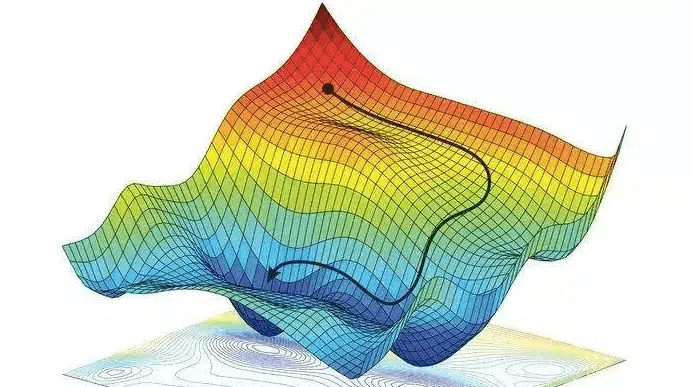

# Backpropagation

## Introdução

Na aula anterior, você aprendeu que as redes neurais são como calculadoras especializadas que podem resolver problemas complexos. Mas uma pergunta ficou no ar: **como elas aprendem?** Como uma rede neural descobre quais pesos usar para acertar as respostas?

Imagine que você está tentando ensinar um amigo a chutar penalidades. Você não pode simplesmente dizer "chute melhor" — precisa ser específico: "mire um pouco mais para a esquerda", "chute com menos força", "ajuste o ângulo do pé". O **backpropagation** é exatamente isso: uma forma sistemática de dizer para cada neurônio da rede como se ajustar para melhorar o resultado final.

Este algoritmo revolucionou a inteligência artificial e é a base de praticamente tudo que vemos hoje em IA, desde reconhecimento de voz até carros autônomos!


[](https://youtu.be/mBqfY_TX_8o?si=5MPHq_4fcbatMgD2)


## O problema do aprendizado


Encontrar o peso para um perceptron é facil porque era é um neurônio. Mas em uma rede com várias camadas, surge um problema: **como saber qual neurônio da camada oculta é responsável pelo erro?**

É como tentar descobrir qual jogador de um time de futebol errou quando o time perde — pode ter sido o goleiro, o zagueiro, o meio-campo ou o atacante. Todos contribuíram para o resultado final!

<?quiz?>
question: Por que o algoritmo de aprendizado do Perceptron não funciona diretamente em redes multicamadas?
answer: Porque redes multicamadas são muito lentas
answer: Porque usa muita memória computacional
answer-correct: Porque não sabemos como atribuir responsabilidade pelo erro aos neurônios das camadas ocultas
answer: Porque as funções de ativação são diferentes
content:

Em redes multicamadas, todos os neurônios contribuem para o resultado final, tornando difícil saber exatamente como ajustar cada peso individual quando há um erro na saída.
<?/quiz?>

## O Backpropagation

A solução é **propagar o erro de volta** através da rede, camada por camada. É como rastrear a origem de um problema:

1. **Calcule o erro na saída** (o quanto erramos)
2. **Distribua a "culpa"** para a última camada oculta
3. **Continue distribuindo** para as camadas anteriores
4. **Ajuste os pesos** baseado na "responsabilidade" de cada um

É como investigar um acidente: você começa pelo resultado e vai voltando para descobrir todas as causas que contribuíram.

## Intuição matemática

### Função de custo: medindo o erro

Primeiro, precisamos medir "o quanto erramos". Usamos uma **função de custo** (ou função de perda / loss function):

```
Erro = (Saída_Desejada - Saída_Real)²
```

Para múltiplos exemplos:

```
Custo_Total = Média_de_todos_os_erros
```

**Objetivo**: Minimizar esse custo ajustando os pesos!

<?quiz?>
question: Qual é o objetivo principal da função de custo no backpropagation?
answer: Acelerar o treinamento da rede neural
answer: Escolher a melhor arquitetura de rede
answer-correct: Medir quantitativamente o erro para guiar o ajuste dos pesos
answer: Determinar o número ideal de neurônios
content:

A função de custo quantifica o erro da rede, fornecendo uma métrica clara de quão distantes estamos do resultado desejado, permitindo ajustar os pesos na direção correta.
<?/quiz?>

### Gradiente

O **gradiente** nos diz em qual direção ajustar cada peso para reduzir o erro. É como uma bússola que aponta para a direção da melhoria!



**Analogia da montanha**:

- Você está perdido numa montanha com neblina (não vê o objetivo)
- Quer chegar ao vale (minimizar o erro)
- O gradiente é como uma bússola que sempre aponta "descida mais íngreme"
- Seguindo essa direção, eventualmente chegará ao fundo

### Regra de atualização dos pesos

```
Peso_Novo = Peso_Antigo - Taxa_de_Aprendizado × Gradiente
```

- **Taxa de aprendizado**: o tamanho do "passo" que damos

  - Muito grande → podemos "pular" a solução
  - Muito pequeno → demora muito para aprender

## O algoritmo passo a passo

1. **Propagação direta (forward pass)**:
    
    - Os dados de entrada percorrem a rede camada por camada, gerando a saída final.

2. **Cálculo do erro**:  
    
    - Comparação entre a saída prevista e a saída real usando uma função de custo (ex.: erro quadrático médio).
    
    ```
    Input → Camada1 → Camada2 → ... → Output → Calcular_Erro
    ```
3. **Propagação reversa (backward pass)**:  
    
    - O erro é propagado de volta pela rede, calculando o gradiente de cada peso em relação ao erro.

4. **Atualização dos pesos**:  

    - Cada peso é ajustado na direção que reduz o erro, de acordo com a taxa de aprendizado.

    ```
    Ajustar_Pesos ← ... ← Camada2 ← Camada1 ← Calcular_Gradientes ← Erro
    ```

## Exercício Interativo – Passo a passo do Backpropagation

Neste exercício, você pode **controlar a execução do backpropagation** e visualizar:

- Como as ativações são calculadas na **propagação direta**.
- Como o erro se espalha de volta na **propagação reversa**.
- Como cada peso é atualizado após cada passo.

**Controles disponíveis:**

- **Taxa de aprendizado (learning rate)**: Ajuste para ver como afeta a convergência.
- **Função de ativação**: Escolha entre `Sigmoid`, `Tanh` e `ReLU`.
- **Botão "Próximo passo"**: Avança o backpropagation de forma manual.
- **Botão "Treinar automático"**: Executa várias iterações seguidas.
- **Mostrar gradientes**: Ativa setas e valores numéricos sobre cada peso.

**Objetivo**:  

Familiarizar-se com o funcionamento interno do backpropagation e entender o impacto da taxa de aprendizado e da função de ativação no treinamento.

<div id="backprop-widget" style="max-width:980px;margin:1.25rem 0;padding:1rem;border:1px solid var(--md-default-fg-color--lightest,#e0e0e0);border-radius:14px;background:var(--md-default-bg-color,#fff)">
  <h3>Backpropagation – Passo a Passo</h3>

  <div style="display:flex;gap:1rem;flex-wrap:wrap;align-items:flex-end">
    <label style="flex:1 1 180px">
      <div>Taxa de aprendizado (η): <strong><span id="bp_lrVal">0.10</span></strong></div>
      <input id="bp_lr" type="range" min="0.01" max="1.00" step="0.01" value="0.10" style="width:100%">
    </label>

    <label style="flex:1 1 180px">
      <div>Função de ativação</div>
      <select id="bp_act" style="width:100%">
        <option value="sigmoid">Sigmoid</option>
        <option value="tanh">Tanh</option>
        <option value="relu">ReLU</option>
      </select>
    </label>

    <div style="flex:1 1 280px;display:flex;gap:.5rem;justify-content:flex-end">
      <button id="bp_next" class="md-button md-button--primary">Próximo passo</button>
      <button id="bp_auto" class="md-button">Treinar automático</button>
      <button id="bp_reset" class="md-button">Reset</button>
    </div>
  </div>

  <div style="margin-top:1rem;display:flex;gap:1rem;flex-wrap:wrap">
    <canvas id="bp_canvas" width="500" height="300" style="background:#fff;border-radius:8px;border:1px solid #ccc"></canvas>
    <div style="flex:1 1 260px;font-size:0.9em;line-height:1.6">
      <div><strong>Época:</strong> <span id="bp_epoch">0</span></div>
      <div><strong>Erro (MSE):</strong> <span id="bp_err">—</span></div>
      <div><strong>Saída prevista:</strong> <span id="bp_out">—</span></div>
      <div><strong>Gradientes:</strong> <pre id="bp_grads" style="white-space:pre-wrap;background:#f7f7f7;padding:0.5rem;border-radius:4px">—</pre></div>
    </div>
  </div>
</div>


Reflexão:

1. O que acontece quando a taxa de aprendizado é **muito alta**? E quando é **muito baixa**?

2. Compare o comportamento do gradiente com **Sigmoid**, **Tanh** e **ReLU**.  

   - Em qual caso o gradiente tende a "desaparecer" (vanishing gradient)?
   - Em qual caso o gradiente é mais estável?

3. Como o número de passos influencia na convergência do erro?

4. Observe o gráfico de erro:

   - Ele desce de forma suave ou com oscilações?
   - Há momentos em que o treinamento "trava"?


<?quiz?>
question: Por que o backpropagation calcula gradientes "de trás para frente"?
answer: Porque é mais rápido computacionalmente
answer: Porque usa menos memória
answer-correct: Porque o erro na saída é conhecido, facilitando o cálculo dos gradientes das camadas anteriores
answer: Porque as camadas ocultas são mais importantes
content:

Começamos pela saída porque conhecemos o erro desejado ali. Isso permite calcular como cada camada anterior contribuiu para esse erro, propagando a informação de volta pela rede.
<?/quiz?>

## Implementação conceitual (pseudocódigo)

```python
# Algoritmo Backpropagation Simplificado

def treinar_rede(rede, dados_treino, taxa_aprendizado):
    for cada_época:
        for cada_exemplo in dados_treino:
            
            # FORWARD PASS
            entrada = exemplo.dados
            for camada in rede:
                entrada = camada.processar(entrada)
            saída_predita = entrada
            
            # CALCULAR ERRO
            erro = exemplo.resposta_correta - saída_predita
            
            # BACKWARD PASS
            gradiente = calcular_gradiente_saída(erro)
            for camada in reversed(rede):
                gradiente = camada.calcular_gradiente(gradiente)
                camada.atualizar_pesos(gradiente, taxa_aprendizado)
```

## Detalhes importantes

### Chain Rule (Regra da Cadeia)

O backpropagation usa a **regra da cadeia** do cálculo para "quebrar" gradientes complexos em pedaços menores.

**Analogia da fábrica**:
- Produto final depende da máquina C
- Máquina C depende da máquina B  
- Máquina B depende da máquina A
- Para otimizar A, precisamos saber como A afeta B, como B afeta C, e como C afeta o produto final

### Funções de ativação e derivadas

Por que ReLU é tão popular? Sua derivada é super simples:

```
ReLU(x) = max(0, x)
Derivada = { 1 se x > 0
           { 0 se x ≤ 0
```

Sigmóide tem derivada mais complicada, tornando o cálculo mais lento.

<?quiz?>
question: Por que a derivada da função de ativação é importante no backpropagation?
answer: Para determinar o número de neurônios necessários
answer: Para escolher a arquitetura da rede
answer-correct: Para calcular como o erro se propaga através de cada neurônio
answer: Para definir a taxa de aprendizado ideal
content:

A derivada da função de ativação é essencial para aplicar a regra da cadeia e calcular como pequenas mudanças nos pesos afetam o erro final da rede.
<?/quiz?>

## Hiperparâmetros importantes

### Taxa de Aprendizado (Learning Rate)

- **Muito alta** (ex: 1.0): pode divergir, "pulando" soluções
- **Muito baixa** (ex: 0.0001): aprende muito devagar
- **Típica**: entre 0.001 e 0.1

### Batch Size

- **Batch completo**: usa todos os dados para cada atualização
- **Mini-batch**: usa pequenos grupos (ex: 32 exemplos)
- **Stochastic**: usa um exemplo por vez

### Épocas

Número de vezes que a rede "vê" todo o conjunto de dados.

## Problemas comuns e soluções

### 1. Vanishing Gradients (gradientes que somem)

**Problema**: Em redes muito profundas, gradientes ficam minúsculos nas primeiras camadas.

**Soluções**:
- Use ReLU em vez de sigmóide
- Inicialização adequada dos pesos
- Batch Normalization
- Skip connections (ResNet)

### 2. Exploding Gradients (gradientes que explodem)

**Problema**: Gradientes ficam enormes, causando instabilidade.

**Soluções**:
- Gradient clipping (cortar gradientes muito grandes)
- Taxa de aprendizado menor
- Melhor inicialização

### 3. Overfitting

**Problema**: Rede "decora" dados de treino, não generaliza.

**Soluções**:
- Dropout
- Regularização (L1/L2)
- Mais dados
- Early stopping

<?quiz?>
question: O que caracteriza o problema de "vanishing gradients"?
answer: A rede aprende muito rapidamente
answer: Os pesos ficam muito grandes
answer-correct: Os gradientes se tornam muito pequenos nas camadas iniciais de redes profundas
answer: A função de custo aumenta durante o treinamento
content:

Vanishing gradients ocorre quando gradientes se tornam exponencialmente menores à medida que se propagam para trás, fazendo com que as primeiras camadas aprendam muito lentamente ou parem de aprender.
<?/quiz?>

## Variações e melhorias

### Otimizadores avançados

**SGD (Stochastic Gradient Descent)**: O básico
```
peso = peso - taxa_aprendizado × gradiente
```

**Momentum**: Adiciona "inércia"
```
velocidade = momentum × velocidade_anterior + gradiente
peso = peso - taxa_aprendizado × velocidade
```

**Adam**: Adapta taxa de aprendizado automaticamente
- Muito popular atualmente
- Combina momentum com adaptação automática

### Learning Rate Scheduling

- **Step decay**: Reduz taxa periodicamente
- **Exponential decay**: Reduz exponencialmente
- **Cosine annealing**: Varia como coseno

## Exemplo prático: XOR com backpropagation

Vamos resolver o problema que quebrou o Perceptron!

```python
# Rede para XOR (conceitual)
import numpy as np

# Dados XOR
X = [[0,0], [0,1], [1,0], [1,1]]
Y = [0, 1, 1, 0]

# Arquitetura: 2 entradas → 2 ocultos → 1 saída
# Consegue resolver XOR!

for época in range(1000):
    for x, y_real in zip(X, Y):
        # Forward pass
        hidden = sigmoid(x @ W1 + b1)
        output = sigmoid(hidden @ W2 + b2)
        
        # Calcular erro
        erro = y_real - output
        
        # Backward pass
        grad_output = erro * sigmoid_derivative(output)
        grad_hidden = (grad_output @ W2.T) * sigmoid_derivative(hidden)
        
        # Atualizar pesos
        W2 += learning_rate * hidden.T @ grad_output
        W1 += learning_rate * x.T @ grad_hidden
```

## Resumo e próximos passos

### O que aprendemos hoje

1. **Backpropagation** resolve o problema de como treinar redes multicamadas
2. Funciona **propagando erros de volta** através da rede
3. Usa **gradientes** para saber como ajustar cada peso
4. É a base de praticamente toda IA moderna
5. Tem **hiperparâmetros importantes** que precisam ser ajustados

### Conceitos-chave para lembrar

- **Forward pass**: dados fluem da entrada para saída
- **Backward pass**: erros fluem da saída para entrada  
- **Gradiente**: direção para reduzir o erro
- **Taxa de aprendizado**: tamanho do passo de otimização
- **Regra da cadeia**: como "quebrar" derivadas complexas

### Para onde vamos?

- **Redes Convolucionais (CNNs)**: especializadas em imagens
- **Redes Recorrentes (RNNs)**: memória para sequências
- **Transformers**: revolução atual da IA
- **Técnicas de regularização**: evitando overfitting
- **Transfer Learning**: aproveitando modelos pré-treinados

### Quiz final de revisão

<?quiz?>
question: Qual é a ideia central do algoritmo backpropagation?
answer: Treinar apenas a última camada da rede
answer: Usar apenas exemplos positivos para treinar
answer-correct: Propagar o erro da saída de volta através da rede para ajustar todos os pesos
answer: Treinar cada camada separadamente
content:

Backpropagation propaga o erro calculado na saída de volta através de todas as camadas, permitindo que cada peso seja ajustado proporcionalmente à sua contribuição para o erro final.
<?/quiz?>

<?quiz?>
question: Por que a taxa de aprendizado é um hiperparâmetro crítico?
answer: Porque determina o número de camadas da rede
answer: Porque escolhe a função de ativação
answer-correct: Porque controla o tamanho dos ajustes nos pesos durante o treinamento
answer: Porque define quantos dados usar para treinar
content:

A taxa de aprendizado determina quão grandes são os passos de otimização. Muito alta pode causar instabilidade, muito baixa torna o aprendizado lento demais.
<?/quiz?>

<?quiz?>
question: O que diferencia o backpropagation do aprendizado do Perceptron simples?
answer: Backpropagation é mais lento
answer: Backpropagation usa menos memória
answer-correct: Backpropagation pode treinar redes com múltiplas camadas ocultas
answer: Backpropagation funciona apenas com ReLU
content:

Enquanto o Perceptron só consegue ajustar pesos de uma única camada, backpropagation resolve o problema de como treinar todas as camadas de uma rede neural profunda simultaneamente.
<?/quiz?>

---

**Próxima aula**: Redes Neurais Convolucionais (CNNs) — como as máquinas aprenderam a "ver" e revolucionaram o processamento de imagens!

## Exercícios recomendados

1. **Implementação manual**: Tente implementar backpropagation para XOR usando apenas numpy
2. **Experimentos com hiperparâmetros**: Varie taxa de aprendizado e veja o impacto
3. **Visualização**: Plote como o erro diminui durante o treinamento
4. **Comparação**: Compare SGD, Momentum e Adam no mesmo problema

## Leituras complementares

- Deep Learning (Goodfellow, Bengio, Courville) - Capítulo 6
- Neural Networks and Deep Learning (Michael Nielsen) - online
- CS231n Stanford - Lecture notes sobre backpropagation
- Documentação PyTorch/TensorFlow sobre otimizadores
