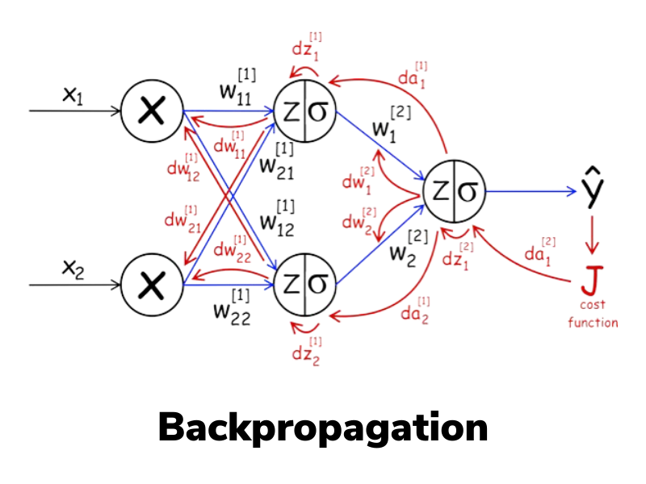

# Backpropagation

## Introdução



Sabemos que redes neurais são como calculadoras especializadas que podem resolver problemas complexos. Mas uma pergunta ficou no ar: **como elas aprendem?** Como uma rede neural descobre quais pesos usar para acertar as respostas?

Pense em ensinar um amigo a cobrar pênaltis. Não adianta dizer apenas “chute melhor”, isso é vago demais. É preciso dar instruções precisas, como: “mire um pouco mais para a esquerda”, “reduza a força do chute” ou “ajuste o ângulo do pé”.

O **backpropagation** faz exatamente isso, mas para redes neurais: é um método sistemático para indicar a cada neurônio o quanto e em que direção ajustar seus parâmetros, a fim de melhorar o resultado final.

Este algoritmo revolucionou a inteligência artificial e é a base de praticamente tudo que vemos hoje em IA, desde reconhecimento de voz até carros autônomos!


[](https://youtu.be/mBqfY_TX_8o)


## O problema do aprendizado


Encontrar os pesos para um perceptron é fácil porque há apenas um neurônio. Mas em uma rede com várias camadas, surge um problema: **como saber qual neurônio da camada oculta é responsável pelo erro?**

É como tentar descobrir qual jogador de um time de futebol errou quando o time perde — pode ter sido o goleiro, o zagueiro, o meio-campo ou o atacante. Todos contribuíram para o resultado final!

<?quiz?>
question: Por que o algoritmo de aprendizado do Perceptron não funciona diretamente em redes multicamadas?
answer: Porque redes multicamadas são muito lentas
answer: Porque usa muita memória computacional
answer-correct: Porque não sabemos como atribuir responsabilidade pelo erro aos neurônios das camadas ocultas
answer: Porque as funções de ativação são diferentes
content:

Em redes multicamadas, todos os neurônios contribuem para o resultado final, tornando difícil saber exatamente como ajustar cada peso individual quando há um erro na saída.
<?/quiz?>

## O Backpropagation

A solução é **propagar o erro de volta** através da rede, camada por camada. É como rastrear a origem de um problema:

1. **Calcule o erro na saída** (o quanto erramos)
2. **Distribua a "culpa"** para a última camada oculta
3. **Continue distribuindo** para as camadas anteriores
4. **Ajuste os pesos** baseado na "responsabilidade" de cada um

É como investigar um acidente: você começa pelo resultado e vai voltando para descobrir todas as causas que contribuíram.

## Intuição Matemática

### Função de Perda (Loss) e Entropia Cruzada Binária (BCE)

Em redes neurais, o treinamento envolve ajustar os parâmetros (pesos e biases) para que o modelo produza saídas o mais próximas possível das saídas desejadas. Para guiar esse ajuste, precisamos de uma métrica quantitativa que capture `o quanto o modelo está errando`. Essa métrica é a **função de perda** (ou função de custo, *loss function*), que mede a discrepância entre as predições do modelo ($\hat{y}$) e os rótulos verdadeiros ($y$).

Suponha uma tarefa de regressão linear, onde queremos prever um valor contínuo. Uma função de perda comum é o **erro quadrático médio** (Mean Squared Error, MSE):

- Para um único exemplo $i$:  
  $$
  \ell(\hat{y}^{(i)}, y^{(i)}) = \left( y^{(i)} - \hat{y}^{(i)} \right)^2
  $$

- Para um lote (*batch*) de $m$ exemplos:  
  $$
  J = \frac{1}{m} \sum_{i=1}^{m} \ell\left( \hat{y}^{(i)}, y^{(i)} \right) = \frac{1}{m} \sum_{i=1}^{m} \left( y^{(i)} - \hat{y}^{(i)} \right)^2
  $$

Aqui, o quadrado garante que erros positivos e negativos não se cancelem, e penaliza erros maiores de forma quadrática (ou seja, um erro de 2 é penalizado 4 vezes mais que um erro de 1, incentivando o modelo a evitar grandes desvios).

!!! note "Requisitos para uma Boa Função de Perda"
    A função de perda deve ser **diferenciável** (quase em todos os pontos) para permitir o cálculo de gradientes via backpropagation. Além disso, ela deve ser convexa ou quasi-convexa em problemas ideais, facilitando a convergência para um mínimo global. O objetivo do treinamento é minimizar $J$ ajustando os pesos $\theta$ do modelo:  
    $$
    \theta^* = \arg\min_{\theta} J(\theta)
    $$
    Usamos otimização baseada em gradientes para isso, como o `Gradiente Descendente`.

Agora, foquemos em tarefas de classificação binária, onde $y \in \{0, 1\}$ (ex.: "é spam ou não?"). Aqui, a saída do modelo é tipicamente uma probabilidade $\hat{y} = \sigma(z) \in (0,1)$, onde $\sigma$ é a função Sigmoid aplicada ao *logit* $z$ (saída linear antes da ativação). 
A função de perda tipica é a **Entropia Cruzada Binária** (Binary Cross-Entropy, BCE) ou **log loss**:

$$
\ell_{\text{BCE}}(y, \hat{y}) = -\left[ y \log(\hat{y}) + (1 - y) \log(1 - \hat{y}) \right]
$$

- **Interpretação Probabilística**: A BCE deriva do negativo do logaritmo da verossimilhança (*negative log-likelihood*) sob uma distribuição de Bernoulli. Se $y=1$, a perda penaliza quando $\hat{y}$ está longe de 1 (ou seja, $\log(\hat{y})$ é muito negativo se $\hat{y}$ for pequeno). Se $y=0$, penaliza quando $\hat{y}$ está longe de 0. Isso incentiva predições "confiantes" apenas quando corretas; predições erradas e confiantes (ex.: $\hat{y}=0.99$ quando $y=0$) recebem penalidades altas devido ao logaritmo.

- **Derivação Rápida do Gradiente**: Uma propriedade chave da BCE combinada com Sigmoid é a simplificação do gradiente. Vamos derivar brevemente:  
  A perda em termos do logit $z$ é $\ell(y, \sigma(z)) = -[y \log(\sigma(z)) + (1-y) \log(1 - \sigma(z))]$.  
  Usando a regra da cadeia:  
  $$
  \frac{\partial \ell}{\partial z} = \frac{\partial \ell}{\partial \hat{y}} \cdot \frac{\partial \hat{y}}{\partial z} = \left( \frac{\hat{y} - y}{\hat{y}(1 - \hat{y})} \right) \cdot \hat{y}(1 - \hat{y}) = \hat{y} - y
  $$
  Essa simplificação torna o backpropagation computacionalmente eficiente e numericamente estável, evitando problemas como vanishing gradients em camadas profundas.

Para um batch:  
$$
J_{\text{BCE}} = \frac{1}{m} \sum_{i=1}^{m} \ell_{\text{BCE}}(y^{(i)}, \hat{y}^{(i)})
$$

!!! tip "Extensão para Classificação Multiclasse"
    Para $K$ classes, use a ativação softmax na saída final ($\hat{y}_k = \frac{e^{z_k}}{\sum_{j=1}^K e^{z_j}}$) e a Entropia Cruzada Categórica:  
    $$
    \ell_{\text{CE}}(y, \hat{y}) = -\sum_{k=1}^K y_k \log(\hat{y}_k)
    $$  
    onde $y$ é um vetor *one-hot*. O gradiente em relação aos logits também simplifica para $\frac{\partial \ell}{\partial z_k} = \hat{y}_k - y_k$, facilitando o treinamento.

<?quiz?>
question: Qual é o objetivo principal da função de custo no backpropagation?
answer: Acelerar o treinamento da rede neural
answer: Escolher a melhor arquitetura de rede
answer-correct: Medir quantitativamente o erro para guiar o ajuste dos pesos
answer: Determinar o número ideal de neurônios
content:

A função de custo quantifica o erro da rede, fornecendo uma métrica clara de quão distantes estamos do resultado desejado, permitindo ajustar os pesos na direção correta via gradientes.
<?/quiz?>

### O Gradiente: A Direção da Mudança

O **gradiente** de uma função $J(\theta)$ em relação aos parâmetros $\theta$ é um vetor que aponta na direção de maior aumento de $J$. Para minimizar $J$, movemos na direção oposta (descida). Matematicamente, para um parâmetro $\theta_j$:  
$$
\frac{\partial J}{\partial \theta_j}
$$  
representa quanto $J$ muda se alterarmos $\theta_j$ infinitesimalmente.

**Analogia da Montanha (com Toque Técnico)**:  
Imagine $J(\theta)$ como uma superfície montanhosa em um espaço de alta dimensionalidade (cada dimensão é um parâmetro $\theta$). Você está em um ponto $\theta$ atual, envolto em neblina (sem visão global). O gradiente $\nabla J(\theta)$ é como uma bússola que mede a inclinação local mais íngreme para cima. Para descer, siga $-\nabla J(\theta)$. Em cada passo, recalcule o gradiente localmente — isso é o Gradiente Descendente Estocástico (SGD) ou variantes como Adam.


Em redes neurais, o gradiente é computado via backpropagation: propagamos o erro da saída para as camadas anteriores, usando a regra da cadeia para calcular derivadas parciais em cada peso.

### Regra de Atualização dos Pesos

A atualização dos pesos segue o Gradiente Descendente:  
$$
\theta_{\text{novo}} = \theta_{\text{antigo}} - \eta \cdot \nabla J(\theta)
$$  
onde $\eta$ (se pronuncia eta) é a **taxa de aprendizado** (*learning rate*), controlando o tamanho do passo.

- **Escolha de $\eta$**:  
  - Muito grande: Pode oscilar ou divergir (ex.: "pular" sobre o mínimo).  
  - Muito pequeno: Convergência lenta, risco de ficar preso em mínimos locais.  
  Soluções comuns: Agendadores de learning rate (ex.: decaimento exponencial) ou otimizadores adaptativos como Adam, que ajustam $\eta$ por parâmetro com base em momentos de gradientes passados.

Em prática, para estabilidade, usamos mini-batches (SGD) em vez de batches completos, introduzindo ruído que ajuda a escapar de mínimos locais. Variantes avançadas incluem momentum (acelera em direções consistentes) e RMSProp (normaliza gradientes em dimensões variáveis).

## O algoritmo passo a passo

1. **Propagação direta (forward pass)**:
    
    - Os dados de entrada percorrem a rede camada por camada, gerando a saída final.

2. **Cálculo do erro**:  
    
    - Comparação entre a saída prevista e a saída real usando uma função de custo (ex.: erro quadrático médio).
    
    ```
    Input → Camada1 → Camada2 → ... → Output → Calcular_Erro
    ```
3. **Propagação reversa (backward pass)**:  
    
    - O erro é propagado de volta pela rede, calculando o gradiente de cada peso em relação ao erro.

4. **Atualização dos pesos**:  

    - Cada peso é ajustado na direção que reduz o erro, de acordo com a taxa de aprendizado.

    ```
    Ajustar_Pesos ← ... ← Camada2 ← Camada1 ← Calcular_Gradientes ← Erro
    ```

## Exercício Interativo – Passo a passo do Backpropagation

Neste exercício, você pode **controlar a execução do backpropagation** e visualizar:

- Como as ativações são calculadas na **propagação direta**.
- Como o erro se espalha de volta na **propagação reversa**.
- Como cada peso é atualizado após cada passo.

**Controles disponíveis:**

- **Taxa de aprendizado (learning rate)**: Ajuste para ver como afeta a convergência.
- **Função de ativação**: Escolha entre `Sigmoid`, `Tanh` e `ReLU`.
- **Botão "Próximo passo"**: Avança o backpropagation de forma manual.
- **Botão "Treinar automático"**: Executa várias iterações seguidas.
- **Mostrar gradientes**: Ativa setas e valores numéricos sobre cada peso.

**Objetivo**:  

Familiarizar-se com o funcionamento interno do backpropagation e entender o impacto da taxa de aprendizado e da função de ativação no treinamento.

<div id="backprop-widget" style="max-width:980px;margin:1.25rem 0;padding:1rem;border:1px solid var(--md-default-fg-color--lightest,#e0e0e0);border-radius:14px;background:var(--md-default-bg-color,#fff)">
  <h3>Backpropagation – Passo a Passo</h3>

  <div style="display:flex;gap:1rem;flex-wrap:wrap;align-items:flex-end">
    <label style="flex:1 1 180px">
      <div>Taxa de aprendizado (η): <strong><span id="bp_lrVal">0.10</span></strong></div>
      <input id="bp_lr" type="range" min="0.01" max="1.00" step="0.01" value="0.10" style="width:100%">
    </label>

    <label style="flex:1 1 180px">
      <div>Função de ativação</div>
      <select id="bp_act" style="width:100%">
        <option value="sigmoid">Sigmoid</option>
        <option value="tanh">Tanh</option>
        <option value="relu">ReLU</option>
      </select>
    </label>

    <div style="flex:1 1 280px;display:flex;gap:.5rem;justify-content:flex-end">
      <button id="bp_next" class="md-button md-button--primary">Próximo passo</button>
      <button id="bp_auto" class="md-button">Treinar automático</button>
      <button id="bp_reset" class="md-button">Reset</button>
    </div>
  </div>

  <div style="margin-top:1rem;display:flex;gap:1rem;flex-wrap:wrap">
    <canvas id="bp_canvas" width="500" height="300" style="background:#fff;border-radius:8px;border:1px solid #ccc"></canvas>
    <div style="flex:1 1 260px;font-size:0.9em;line-height:1.6">
      <div><strong>Época:</strong> <span id="bp_epoch">0</span></div>
      <div><strong>Erro (MSE):</strong> <span id="bp_err">—</span></div>
      <div><strong>Saída prevista:</strong> <span id="bp_out">—</span></div>
      <div><strong>Alvo (y):</strong> <span id="bp_target">1</span></div>
      <div><strong>Erro absoluto |ŷ − y|:</strong> <span id="bp_abs">—</span></div>
      <div><strong>Gradientes:</strong> <pre id="bp_grads" style="white-space:pre-wrap;background:#f7f7f7;padding:0.5rem;border-radius:4px">—</pre></div>
    </div>
  </div>
  <div style="margin-top:1rem">
    <h4 style="margin:.25rem 0">Curva de perda (MSE)</h4>
    <canvas id="bp_loss" width="760" height="200" style="width:100%;background:#fff;border:1px solid #ccc;border-radius:8px"></canvas>
  </div>
</div>

Para uma rede 2–2–1 com saída Sigmoid e MSE:
$$
L=\tfrac12(y - \hat y)^2
\hat y=\sigma(z_2)
z_2 = v_1 a_1 + v_2 a_2 + c 
a_i = g(z_i),\ z_i = w_{i1}x_1 + w_{i2}x_2 + b_i
$$

As equações a seguir mostram como o erro é propagado da camada de saída para as camadas anteriores:

$$ \begin{align} \frac{\partial \ell}{\partial z_2} &= (\hat{y} - y) \cdot \sigma'(z_2) \ \frac{\partial \ell}{\partial v_i} &= a_i \cdot \frac{\partial \ell}{\partial z_2} \ \frac{\partial \ell}{\partial a_i} &= v_i \cdot \frac{\partial \ell}{\partial z_2} \ \frac{\partial \ell}{\partial z_i} &= \frac{\partial \ell}{\partial a_i} \cdot g'(z_i) \ \frac{\partial \ell}{\partial w_{ij}} &= x_j \cdot \frac{\partial \ell}{\partial z_i} \end{align} $$

Essas equações formam a base do algoritmo de backpropagation, permitindo que os gradientes sejam calculados camada por camada, da saída para a entrada, para atualizar os pesos da rede neural de forma eficiente.


Reflexão:

1. O que acontece quando a taxa de aprendizado é **muito alta**? E quando é **muito baixa**?
2. Compare o comportamento do gradiente com **Sigmoid**, **Tanh** e **ReLU**.  

   - Em qual caso o gradiente tende a "desaparecer" (vanishing gradient)?
   - Em qual caso o gradiente é mais estável?

3. Como o número de passos influencia na convergência do erro?
4. Observe o gráfico de erro:

   - Ele desce de forma suave ou com oscilações?
   - Há momentos em que o treinamento "trava"?


<?quiz?>
question: Por que o backpropagation calcula gradientes "de trás para frente"?
answer: Porque é mais rápido computacionalmente
answer: Porque usa menos memória
answer-correct: Porque o erro na saída é conhecido, facilitando o cálculo dos gradientes das camadas anteriores
answer: Porque as camadas ocultas são mais importantes
content:

Começamos pela saída porque conhecemos o erro desejado ali. Isso permite calcular como cada camada anterior contribuiu para esse erro, propagando a informação de volta pela rede.
<?/quiz?>

## Pseudocódigo

```python
# Algoritmo Backpropagation Simplificado

def treinar_rede(rede, dados_treino, taxa_aprendizado):
    for cada_época:
        for cada_exemplo in dados_treino:
            
            # FORWARD PASS (predição)
            entrada = exemplo.dados
            for camada in rede:
                entrada = camada.processar(entrada)
            saída_predita = entrada
            
            # CALCULAR ERRO
            erro = exemplo.resposta_correta - saída_predita
            
            # BACKWARD PASS
            gradiente = calcular_gradiente_saída(erro)
            for camada in reversed(rede):
                gradiente = camada.calcular_gradiente(gradiente)
                camada.atualizar_pesos(gradiente, taxa_aprendizado)
```
!!! note "Regra da cadeia"
    O backpropagation usa a **regra da cadeia** do cálculo para "quebrar" gradientes complexos em pedaços menores.

## Funções de ativação e derivadas

Por que ReLU é tão popular? Sua derivada é super simples:

```
ReLU(x) = max(0, x)
Derivada = { 1 se x > 0
           { 0 se x ≤ 0
```

Sigmoid tem derivada mais complicada, tornando o cálculo mais lento.


!!! tip "Loss em classificação binária"
    - **Didático (ok para este exercício):** MSE com saída **Sigmoid**.  
    - **Prática comum:** **Entropia Cruzada Binária** (BCE) com saída **Sigmoid** — converge mais rápido e com gradientes mais estáveis.


<?quiz?>
question: Por que a derivada da função de ativação é importante no backpropagation?
answer: Para determinar o número de neurônios necessários
answer: Para escolher a arquitetura da rede
answer-correct: Para calcular como o erro se propaga através de cada neurônio
answer: Para definir a taxa de aprendizado ideal
content:

A derivada da função de ativação é essencial para aplicar a regra da cadeia e calcular como pequenas mudanças nos pesos afetam o erro final da rede.
<?/quiz?>


## Problemas comuns e soluções

### 1. Vanishing Gradients (gradientes que somem)

**Problema**: Em redes neurais com muitas camadas, o gradiente (que é a informação sobre o quão rápido a rede está aprendendo) se torna extremamente pequeno à medida que volta para as primeiras camadas. Isso faz com que os pesos nessas camadas iniciais sejam atualizados de forma muito lenta, impedindo a rede de aprender de maneira eficaz. É como se a informação de erro se "evaporasse" antes de chegar onde é mais necessária.

**Soluções**:

- `Funções de Ativação`: Troque funções como a Sigmoid ou tanh por ReLU (Rectified Linear Unit), que não "sufoca" o gradiente.
- `Inicialização de Pesos`: Comece o treinamento com pesos que não sejam nem muito grandes, nem muito pequenos. Técnicas como a inicialização de `He` ou de Xavier ajudam a manter os gradientes saudáveis.
- `Normalização de Batch (Batch Normalization)`: Essa técnica ajusta as ativações dentro da rede, garantindo que os dados que fluem entre as camadas mantenham uma distribuição estável.
- `Conexões de Salto (Skip Connections)`: Em arquiteturas como a ResNet, as camadas "pulam" e se conectam diretamente a camadas posteriores, criando um "caminho alternativo" para que o gradiente flua sem ser enfraquecido.

### 2. Exploding Gradients (gradientes que explodem)

**Problema**: É o oposto do anterior. O gradiente se torna extremamente grande, levando a atualizações massivas e instáveis nos pesos. Isso faz com que o modelo "exploda", e o treinamento não converge.

**Soluções**:

- `Corte de Gradiente (Gradient Clipping)`: Simplesmente "corte" o gradiente quando ele atingir um valor muito alto, limitando-o a um limite pré-definido.
- `Taxa de Aprendizado (Learning Rate) Menor`: Reduza a taxa de aprendizado para que as atualizações de peso sejam mais graduais e menos propensas a "explodir".
- `Inicialização Melhor`: A mesma solução para o problema de "vanishing gradients" também ajuda a prevenir as explosões.

### 3. Overfitting

**Problema**: O modelo aprende os dados de treinamento com perfeição, mas não consegue generalizar para novos dados. É como um aluno que memoriza as respostas da prova, mas não entende a matéria. O modelo se torna bom demais nos dados que já viu, mas falha em aplicar o conhecimento em situações novas.

**Soluções**:

- `Aumente os Dados`: A maneira mais eficaz de evitar o overfitting é dar mais exemplos de treinamento para o modelo.
- `Dropout`: Durante o treinamento, essa técnica "desliga" aleatoriamente alguns neurônios em cada iteração. Isso força a rede a não depender de neurônios específicos, tornando-a mais robusta.
- `Regularização (L1/L2)`: Adicione uma "penalidade" à função de perda para desincentivar pesos muito grandes. Isso ajuda a manter o modelo mais simples e com maior poder de generalização.
- `Parada Antecipada (Early Stopping)`: Monitore a performance do modelo em um conjunto de validação e pare o treinamento assim que a performance começar a piorar.

<?quiz?>
question: O que caracteriza o problema de "vanishing gradients"?
answer: A rede aprende muito rapidamente
answer: Os pesos ficam muito grandes
answer-correct: Os gradientes se tornam muito pequenos nas camadas iniciais de redes profundas
answer: A função de custo aumenta durante o treinamento
content:

Vanishing gradients ocorre quando gradientes se tornam exponencialmente menores à medida que se propagam para trás, fazendo com que as primeiras camadas aprendam muito lentamente ou parem de aprender.
<?/quiz?>

## Otimizadores 

**SGD (Stochastic Gradient Descent)**: O básico
```
peso = peso - taxa_aprendizado × gradiente
```

**Momentum**: Adiciona "inércia"
```
velocidade = momentum × velocidade_anterior + gradiente
peso = peso - taxa_aprendizado × velocidade
```

**Adam**: Adapta taxa de aprendizado automaticamente

- Muito popular atualmente
- Combina momentum com adaptação automática

### Learning Rate Scheduling

- **Step decay**: Reduz taxa periodicamente
- **Exponential decay**: Reduz exponencialmente
- **Cosine annealing**: Varia como coseno


<?quiz?>
question: Qual é a ideia central do algoritmo backpropagation?
answer: Treinar apenas a última camada da rede
answer: Usar apenas exemplos positivos para treinar
answer-correct: Propagar o erro da saída de volta através da rede para ajustar todos os pesos
answer: Treinar cada camada separadamente
content:

Backpropagation propaga o erro calculado na saída de volta através de todas as camadas, permitindo que cada peso seja ajustado proporcionalmente à sua contribuição para o erro final.
<?/quiz?>

<?quiz?>
question: Por que a taxa de aprendizado é um hiperparâmetro crítico?
answer: Porque determina o número de camadas da rede
answer: Porque escolhe a função de ativação
answer-correct: Porque controla o tamanho dos ajustes nos pesos durante o treinamento
answer: Porque define quantos dados usar para treinar
content:

A taxa de aprendizado determina quão grandes são os passos de otimização. Muito alta pode causar instabilidade, muito baixa torna o aprendizado lento demais.
<?/quiz?>

<?quiz?>
question: O que diferencia o backpropagation do aprendizado do Perceptron simples?
answer: Backpropagation é mais lento
answer: Backpropagation usa menos memória
answer-correct: Backpropagation pode treinar redes com múltiplas camadas ocultas
answer: Backpropagation funciona apenas com ReLU
content:

Enquanto o Perceptron só consegue ajustar pesos de uma única camada, backpropagation resolve o problema de como treinar todas as camadas de uma rede neural profunda simultaneamente.
<?/quiz?>

<!-- 
**Próxima aula**: Redes Neurais Convolucionais (CNNs) — como as máquinas aprenderam a "ver" e revolucionaram o processamento de imagens! -->
