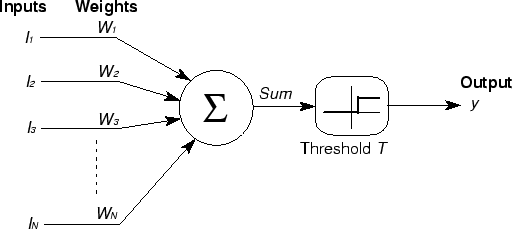

# Redes Neurais Artificiais

## Introdução

Imagine que você está tentando ensinar um computador a reconhecer gatos em fotos. Como você explicaria para uma máquina o que torna um gato um gato? As orelhas pontudas? Os bigodes? O formato dos olhos? Essa é exatamente a inspiração por trás das **Redes Neurais Artificiais (RNA)** — modelos computacionais que tentam imitar como nosso cérebro processa informações complexas.

As RNAs são uma das família de arquiteturas de modelos para aprendizado de máquina, especialmente úteis quando:

- Precisamos **capturar padrões não lineares** complexos que modelos tradicionais não conseguem
- Temos **grandes volumes de dados** e queremos que o próprio modelo descubra as características importantes
- Queremos **processar diferentes tipos de informação** como imagens, texto, áudio ou séries temporais
- O problema é complexo demais para ser resolvido com regras simples

### Quando usar Redes Neurais?

**Considere RNAs quando:**
- Os dados mostram relações **claramente não lineares** entre entradas e saídas
- Você tem **muitos dados** e alta dimensionalidade 
- Precisa de **extração automática de características** (o modelo descobre sozinho o que é importante)
- Quer processar **múltiplas modalidades** (imagem + texto, por exemplo)

**Talvez outras técnicas sejam melhores se:**
- Você tem **poucos dados** ou o problema é simples — experimente modelos lineares, árvores de decisão ou kNN primeiro
- Precisa de **interpretabilidade total** — prefira modelos mais transparentes como árvores ou regressão linear
- Tem pressa para colocar em produção — RNAs precisam de mais tempo para ajuste fino

<?quiz?>
question: Quando as redes neurais são especialmente recomendadas?
answer: Apenas para problemas simples com poucos dados
answer: Somente quando precisamos de máxima interpretabilidade
answer-correct: Para problemas com padrões não lineares complexos e grandes volumes de dados
answer: Exclusivamente para processamento de texto
content:

Redes neurais são boas em cenários com relações complexas não lineares, grandes datasets e quando precisamos que o modelo aprenda automaticamente quais características são importantes.
<?/quiz?>

## Intuição RNA

Para conhecer um pouco da historia, vale a pena assistir esse vídeo.

[](https://youtu.be/V2POyQVQuzA?si=Sz5S1jWPYh52JrIs)

### O neurônio biológico

Nosso cérebro possui cerca de 86 bilhões de neurônios interconectados. Cada neurônio é como uma pequena unidade de processamento que:


```
Dendritos → Soma → Axônio → Sinapses
    ↑        ↑       ↑        ↑
  Entrada  Processamento  Transmissão  Saída
```

**Como funciona a comunicação neural:**

1. **Dendritos** recebem sinais químicos de outros neurônios
2. **Soma** (corpo celular) soma e processa todos esses sinais
3. Se a soma ultrapassa um **limiar**, o neurônio "dispara"
4. O sinal elétrico percorre o **axônio**
5. **Sinapses** liberam neurotransmissores para outros neurônios

É como uma corrente de dominós inteligentes — cada peça decide se vai derrubar a próxima baseado na força do impulso que recebeu!

<?quiz?>
question: Qual é a função principal do soma (corpo celular) no neurônio biológico?
answer: Receber sinais de outros neurônios
answer: Transmitir sinais para outros neurônios
answer-correct: Integrar e processar os sinais recebidos
answer: Armazenar memórias de longo prazo
content:

O soma é responsável por integrar (somar) todos os sinais recebidos pelos dendritos e decidir se o neurônio deve "disparar" ou não, baseado em um limiar de ativação.
<?/quiz?>

## O neurônio artificial

### Como transformamos neurônios em números

Pegamos a ideia do neurônio biológico e criamos uma versão matemática simplificada. Imaginem o neurônio artificial como uma calculadora especializada que:



```
x₁ ──w₁──┐
x₂ ──w₂──┤
    ...  ├─→ Σ ──→ f(net) ──→ y
xₙ ──wₙ──┘
    b ───┘
```

**O que acontece aqui:**

1. **Entradas (x₁, x₂, ..., xₙ)**: Os "dendritos" — informações que chegam
2. **Pesos (w₁, w₂, ..., wₙ)**: A "força das sinapses" — o quanto cada entrada importa
3. **Bias (b)**: O "limiar de ativação" — um ajuste fino
4. **Soma ponderada**: Multiplicamos cada entrada pelo seu peso e somamos tudo
5. **Função de ativação (f)**: Decide se o neurônio "dispara" ou não

**As equações fundamentais:**

```
net = w₁×x₁ + w₂×x₂ + ... + wₙ×xₙ + b
y = f(net)
```

<?quiz?>
question: O que representam os "pesos" em um neurônio artificial?
answer: O número de entradas do neurônio
answer-correct: A importância relativa de cada entrada na decisão final
answer: O tipo de função de ativação utilizada
answer: O valor mínimo para ativação do neurônio
content:

Os pesos determinam o quanto cada entrada influencia na saída final do neurônio. Pesos maiores significam maior importância, enquanto pesos próximos de zero indicam que aquela entrada é quase irrelevante.
<?/quiz?>

### Funções de ativação

As funções de ativação são responsáveis por introduzir não-linearidades no modelo. Sem elas, a rede seria essencialmente um modelo linear e incapaz de aprender e representar dados complexos que requerem não-linearidade para sua modelagem.

A função de ativação é como o interruptor que decide se o neurônio vai "ligar" (disparar) ou "desligar". Cada tipo tem sua personalidade:

#### 1. Função Degrau (Step)

```
f(x) = { 1, se x ≥ 0
       { 0, se x < 0
```
- **Quando usar**: Problemas simples de sim/não
- **Característica**: Tudo ou nada, sem meio termo

#### 2. Função Sigmóide

```
f(x) = 1 / (1 + e^(-x))
```
- **Faixa**: Entre 0 e 1 (ótimo para probabilidades!)
- **Vantagem**: Suave e diferenciável
- **Problema**: Pode "saturar" com valores muito grandes

#### 3. Tangente Hiperbólica (tanh)

```
f(x) = (e^x - e^(-x)) / (e^x + e^(-x))
```
- **Faixa**: Entre -1 e 1
- **Vantagem**: Centrada no zero (melhor que sigmóide)

#### 4. ReLU

```
f(x) = max(0, x)
```

- **Regra**: Se positivo, passa; se negativo, zero
- **Por que é popular**: Simples, rápida e resolve problemas de gradientes em redes profundas

<?quiz?>
question: Por que a função ReLU é tão popular em redes neurais modernas?
answer: Porque sempre retorna valores entre 0 e 1
answer: Porque é a mais complexa matematicamente
answer-correct: Porque é simples, rápida e resolve problemas de gradientes em redes profundas
answer: Porque funciona melhor com dados negativos
content:

ReLU (Rectified Linear Unit) se tornou popular porque sua simplicidade (max(0,x)) a torna computacionalmente eficiente e ajuda a resolver o problema do desvanecimento de gradientes em redes profundas.
<?/quiz?>

## Perceptron:

### A história que mudou tudo

Em 1957, Frank Rosenblatt criou algo revolucionário: o **Perceptron**. Foi a primeira vez que uma máquina conseguiu "aprender" a separar coisas de forma automática. Imagine ensinar um computador a distinguir entre dois grupos de pontos apenas mostrando exemplos!

O Perceptron é como um neurônio artificial muito determinado — ele fica ajustando seus pesos até conseguir separar corretamente os dados. É o avô de todas as redes neurais modernas!

### Como o Perceptron aprende

```
Entrada → Pesos → Soma → Ativação → Saída
x₁,x₂,...,xₙ → w₁,w₂,...,wₙ → Σ → f → y
```

**O algoritmo de aprendizado (versão simplificada):**

1. **Inicializar**: Comece com pesos aleatórios
2. **Para cada exemplo de treino**:
   - Calcule a saída: `y = f(soma dos pesos × entradas)`
   - Compare com a resposta correta
   - **Se errou**: Ajuste os pesos na direção certa
   - **Se acertou**: Continue para o próximo exemplo
3. **Repita** até parar de cometer erros


<?quiz?>
question: Qual foi a principal contribuição histórica do Perceptron?
answer: Foi a primeira rede neural a processar imagens
answer-correct: Foi o primeiro algoritmo de aprendizado para redes neurais com garantia de convergência
answer: Inventou as funções de ativação modernas
answer: Criou o conceito de backpropagation
content:

O Perceptron foi revolucionário porque demonstrou pela primeira vez que uma máquina podia aprender automaticamente a classificar dados, estabelecendo as bases para toda a área de redes neurais.
<?/quiz?>

### O Teorema da Convergência

**A promessa do Perceptron**: Se seus dados puderem ser separados por uma linha reta (ou hiperplano), o Perceptron **sempre** vai encontrar essa linha, em um número finito de passos. É como ter a garantia de que, se existe uma solução, você vai encontrá-la!


#### Objetivo deste exercício

Você poderá:

1. **Ajustar manualmente** os pesos \(w_1, w_2\) e o viés \(b\) para separar os pontos de cada classe.
2. **Treinar automaticamente** usando a **regra de aprendizado do Perceptron**.
3. **Visualizar a fronteira de decisão** mudando de posição conforme os parâmetros.


> **Atividade inicial**:
>
> - Escolha o problema **AND** e tente ajustar manualmente até atingir 100% de acurácia.  
> - Depois, avalie para problema da **OR** e observe o que acontece.
> - Por fim, tente o problema **XOR** e observe o resultado.

<div id="perceptron-widget" style="max-width:980px;margin:1.25rem 0;padding:1rem;border:1px solid var(--md-default-fg-color--lightest,#e0e0e0);border-radius:14px;background:var(--md-default-bg-color,#fff)">
  <h3 style="margin:0 0 .5rem 0">Perceptron — Exercício Interativo</h3>

  <div style="display:flex;gap:1rem;flex-wrap:wrap;align-items:flex-end">
    <label style="flex:1 1 160px">
      <div>w₁: <strong><span id="p_w1Val">0.00</span></strong></div>
      <input id="p_w1" type="range" min="-10" max="10" step="0.01" value="-0.7" style="width:100%">
    </label>
    <label style="flex:1 1 160px">
      <div>w₂: <strong><span id="p_w2Val">0.00</span></strong></div>
      <input id="p_w2" type="range" min="-10" max="10" step="0.01" value="1.23" style="width:100%">
    </label>
    <label style="flex:1 1 160px">
      <div>b: <strong><span id="p_bVal">0.00</span></strong></div>
      <input id="p_b" type="range" min="-10" max="10" step="0.01" value="-0.27" style="width:100%">
    </label>
    <label style="flex:1 1 160px">
      <div>Taxa (η lr): <strong><span id="p_lrVal">0.10</span></strong></div>
      <input id="p_lr" type="range" min="0.01" max="1.00" step="0.01" value="0.10" style="width:100%">
    </label>
    <label style="flex:1 1 160px">
      <div>Épocas: <strong><span id="p_epVal">30</span></strong></div>
      <input id="p_ep" type="range" min="1" max="20" step="1" value="1" style="width:100%">
    </label>

    <label style="flex:1 1 180px">
      <div>Problema</div>
      <select id="p_problem" style="width:100%">
        <option value="AND">AND</option>
        <option value="OR">OR</option>
        <option value="XOR">XOR</option>
      </select>
    </label>

    <div style="flex:1 1 240px;line-height:1.6">
      <div><strong>Acurácia</strong>: <span id="p_acc">—</span></div>
      <label style="display:flex;gap:.5rem;align-items:center">
        <input id="p_showGrid" type="checkbox" checked> mostrar grade
      </label>
    </div>

    <div style="flex:1 1 260px;display:flex;gap:.5rem;justify-content:flex-end">
      <button id="p_btnTrain" class="md-button md-button--primary" style="white-space:nowrap">Treinar</button>
      <button id="p_btnReset" class="md-button" style="white-space:nowrap">Reset</button>
    </div>
  </div>

  <div style="position:relative;margin-top:.75rem">
    <canvas id="perceptronCanvas" width="920" height="540" style="width:100%;display:block;background:#fff;border-radius:10px"></canvas>
    <div style="position:absolute;left:8px;bottom:8px;color:#666;font-size:.85em">
      x₁, x₂ em [−0.2, 1.2] × [−0.2, 1.2] • azul = 0 • vermelho = 1 • linha preta = fronteira w₁x₁ + w₂x₂ + b = 0
    </div>
  </div>
</div>

#### Perguntas para reflexão

1. Por que o Perceptron consegue aprender AND mas não XOR?
2. O que acontece com a fronteira quando alteramos apenas o viés?
3. Como a taxa de aprendizado influencia a velocidade de convergência?


### As limitações que mudaram a história

O Perceptron tinha um problema fatal: **só funcionava para problemas linearmente separáveis**. 

**O famoso problema XOR:**

| Entradas 	| Saída XOR 	| 
|:---:	|:---:	|
| A  B 	| Resultado 	|  
| 0  0 	| 0 	|  
| 0  1 	| 1 	| 
| 1  0 	| 1 	| 
| 1  1 	| 0 	| 

Não importa como você tente, **não existe uma linha reta** que separe corretamente os 1s dos 0s neste problema! Essa limitação quase matou a pesquisa em redes neurais nos anos 1970.


<?quiz?>
question: Por que o problema XOR foi tão significativo para a história das redes neurais?
answer: Porque era muito complexo computacionalmente
answer: Porque envolvia muitas variáveis de entrada
answer-correct: Porque demonstrou que o Perceptron não consegue resolver problemas não linearmente separáveis
answer: Porque precisava de dados muito grandes para treinar
content:

O XOR mostrou uma limitação fundamental do Perceptron: ele só funciona quando os dados podem ser separados por uma linha reta, o que levou ao "inverno da IA" até o desenvolvimento de redes com múltiplas camadas.
<?/quiz?>

## Multilayer Perceptron (MLP)

### A solução para o problema XOR

Os cientistas descobriram algo incrível: **se você empilhar neurônios em camadas**, de repente consegue resolver problemas que pareciam impossíveis! O **MLP (Multilayer Perceptron)** nasceu dessa descoberta.

**Como o MLP supera as limitações:**

1. **Camadas ocultas**: Criam representações intermediárias dos dados
2. **Múltiplas camadas**: Cada camada aprende padrões mais complexos
3. **Backpropagation**: Um algoritmo inteligente que ensina todas as camadas simultaneamente

É como ter vários especialistas trabalhando em sequência — cada um pega o trabalho do anterior e o refina ainda mais!

### A arquitetura em camadas


**O que cada camada faz:**

- **Entrada**: Recebe os dados originais
- **Oculta(s)**: Transformam os dados em representações mais úteis
- **Saída**: Produz a resposta final


### Objetivo deste exercício

Você deve:

1. Treinar um MLP para aprender o XOR usando **backpropagation**.
2. Alterar taxa de aprendizado, épocas e função de ativação (tanh/ReLU).
3. Visualizar a **região de decisão** sendo formada. Olhe a cor de fundo para saber a classe prevista para cada região. Use a linha preta apenas para ver onde a decisão muda (probabilidade ≈ 0.5).

> **Atividade inicial**:
>
> - Treine com `tanh`, η=0.10, 300 épocas.
> - Verifique se a acurácia chega a 100%.
> - Troque para `ReLU` e compare a convergência.

<div id="mlp-xor-widget" style="max-width:980px;margin:1.25rem 0;padding:1rem;border:1px solid var(--md-default-fg-color--lightest,#e0e0e0);border-radius:14px;background:var(--md-default-bg-color,#fff)">
  <h3 style="margin:0 0 .5rem 0">MLP 2–2–1 — XOR </h3>

  <div style="display:flex;gap:1rem;flex-wrap:wrap;align-items:flex-end">
    <label style="flex:1 1 180px">
      <div>Ativação</div>
      <select id="mlp_act" style="width:100%">
        <option value="tanh">tanh</option>
        <option value="relu">ReLU</option>
      </select>
    </label>

    <label style="flex:1 1 160px">
      <div>Taxa (η): <strong><span id="mlp_lrVal">0.10</span></strong></div>
      <input id="mlp_lr" type="range" min="0.01" max="1.0" step="0.01" value="0.10" style="width:100%">
    </label>

    <label style="flex:1 1 160px">
      <div>Épocas: <strong><span id="mlp_epVal">300</span></strong></div>
      <input id="mlp_ep" type="range" min="1" max="2000" step="1" value="3" style="width:100%">
    </label>

    <label style="flex:1 1 160px">
      <div>Batch</div>
      <select id="mlp_batch" style="width:100%">
        <option value="full">full (XOR completo)</option>
        <option value="sgd">SGD (embaralha)</option>
      </select>
    </label>

    <div style="flex:1 1 240px;line-height:1.6">
      <div><strong>Acurácia</strong>: <span id="mlp_acc">—</span></div>
      <label style="display:flex;gap:.5rem;align-items:center">
        <input id="mlp_shade" type="checkbox" checked> mostrar região de decisão
      </label>
    </div>

    <div style="flex:1 1 280px;display:flex;gap:.5rem;justify-content:flex-end">
      <button id="mlp_btnTrain" class="md-button md-button--primary" style="white-space:nowrap">Treinar</button>
      <button id="mlp_btnReset" class="md-button" style="white-space:nowrap">Reset</button>
    </div>
  </div>

  <details style="margin:.5rem 0">
    <summary>Pesos (ler/ajustar manualmente)</summary>
    <div style="display:grid;grid-template-columns:repeat(4,minmax(120px,1fr));gap:.5rem;margin-top:.5rem">
      <label>w11: <input id="mlp_w11" type="number" step="0.01" value="2.00"></label>
      <label>w12: <input id="mlp_w12" type="number" step="0.01" value="2.00"></label>
      <label>w21: <input id="mlp_w21" type="number" step="0.01" value="2.00"></label>
      <label>w22: <input id="mlp_w22" type="number" step="0.01" value="2.00"></label>
      <label>b1:  <input id="mlp_b1"  type="number" step="0.01" value="-0.50"></label>
      <label>b2:  <input id="mlp_b2"  type="number" step="0.01" value="-2.50"></label>
      <label>v1:  <input id="mlp_v1"  type="number" step="0.01" value="1.00"></label>
      <label>v2:  <input id="mlp_v2"  type="number" step="0.01" value="-1.00"></label>
      <label>c:   <input id="mlp_c"   type="number" step="0.01" value="-0.50"></label>
    </div>
  </details>

  <div style="position:relative;margin-top:.75rem">
    <canvas id="mlpCanvas" width="920" height="540" style="width:100%;display:block;background:#fff;border-radius:10px"></canvas>
    <div style="position:absolute;left:8px;bottom:8px;color:#666;font-size:.85em">
      x₁, x₂ em [−0.2, 1.2] × [−0.2, 1.2] • azul = 0 • vermelho = 1 • contorno preto ≈ p=0.5
    </div>
  </div>
</div>

### Perguntas para reflexão

1. Por que o MLP consegue resolver o XOR, mas o Perceptron simples não?
3. Como a taxa de aprendizado afeta a convergência?

<?quiz?>
question: Qual é a principal vantagem das camadas ocultas em um MLP?
answer: Reduzem o tempo de treinamento
answer: Diminuem a quantidade de dados necessários
answer-correct: Permitem aprender representações não lineares dos dados
answer: Simplificam a interpretação do modelo
content:

As camadas ocultas permitem que a rede neural crie transformações não lineares dos dados de entrada, possibilitando resolver problemas como XOR que são impossíveis para um único neurônio.
<?/quiz?>


<?quiz?>
question: Qual é a diferença fundamental entre um Perceptron e um MLP?
answer: O Perceptron usa função ReLU, o MLP usa sigmóide
answer: O Perceptron é mais rápido para treinar
answer-correct: O MLP possui camadas ocultas que permitem resolver problemas não lineares
answer: O Perceptron funciona melhor com grandes datasets
content:

A principal diferença é que o MLP possui camadas ocultas entre a entrada e saída, permitindo aprender padrões não lineares que o Perceptron (com apenas entrada e saída) não consegue capturar.
<?/quiz?>


### O Teorema da Aproximação Universal

**Teorema incrível**: Uma rede neural com **apenas uma camada oculta** e neurônios suficientes pode aproximar **qualquer função contínua** com a precisão que você quiser!

Em outras palavras: teoricamente, você pode ensinar uma rede neural a fazer qualquer coisa (desde que seja uma função matemática contínua). É como ter um "canivete suíço" matemático universal!

*Atenção: o teorema não diz quantos neurônios você precisa — às vezes pode ser um número astronômico!*

### Guia prático: quantos neurônios usar?

Esta é uma das perguntas mais comuns: `Quantos neurônios e quantas camadas devo colocar na minha rede?`

**Regras práticas históricas** (use como ponto de partida, não como lei):

#### Para a camada oculta:

**1. Regra dos 2/3:**
```
neurônios ocultos ≈ (2/3 × neurônios de entrada) + neurônios de saída
```

**2. Média geométrica:**
```
neurônios ocultos ≈ √(entradas × saídas)
```

**3. Experimentação incremental** *`(recomendado hoje)`*:

- Comece pequeno
- Monitore treino vs validação
- Aumente gradualmente
- Use regularização para evitar overfitting

#### Para o número de camadas:

- **1 camada oculta**: Problemas que viram lineares após uma transformação
- **2 camadas**: Qualquer função contínua (teorema da aproximação)
- **3+ camadas**: Funções descontínuas e padrões muito complexos (`Deep Learning!`)

<?quiz?>
question: Segundo o Teorema da Aproximação Universal, quantas camadas ocultas são teoricamente necessárias para aproximar qualquer função contínua?
answer: Infinitas camadas
answer: Pelo menos 3 camadas
answer-correct: Apenas 1 camada oculta (com neurônios suficientes)
answer: Depende do tipo de dados
content:

O teorema estabelece que uma única camada oculta com neurônios suficientes pode aproximar qualquer função contínua, embora na prática múltiplas camadas muitas vezes sejam mais eficientes.
<?/quiz?>