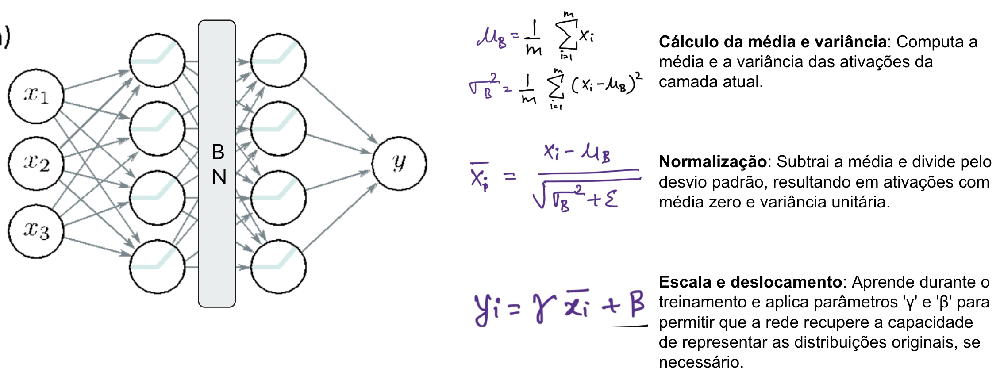
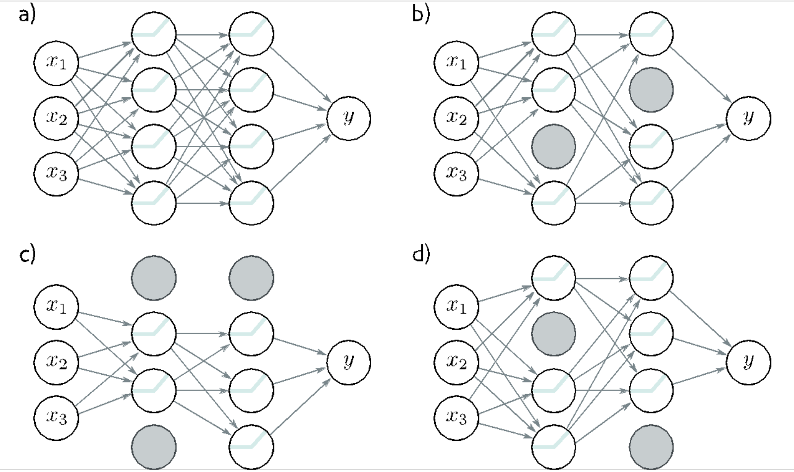
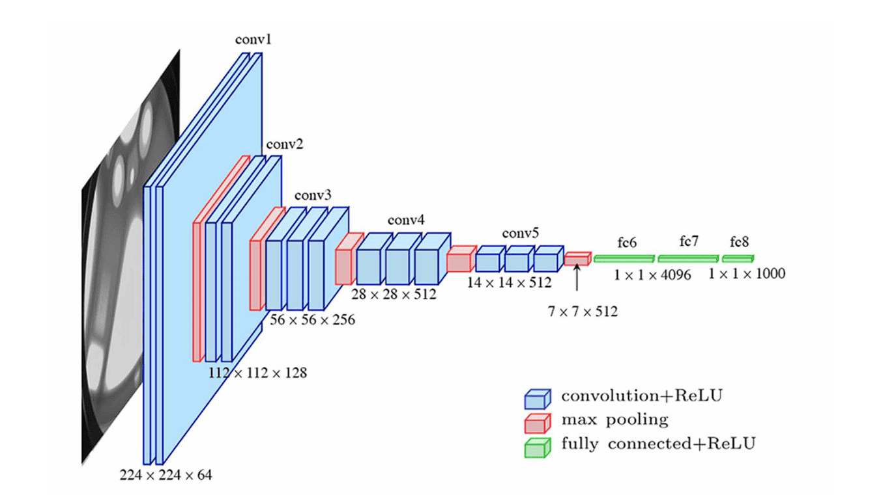
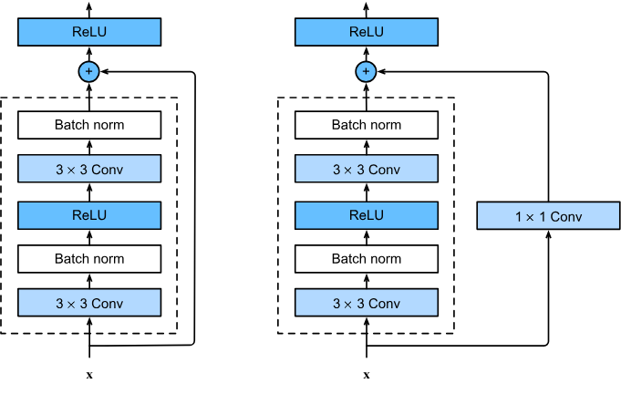

## Introdução às CNNs

### O que são Redes Neurais Convolucionais?

As **Redes Neurais Convolucionais (CNNs)** são um tipo de rede neural artificial, projetada para processar dados que possuem uma **estrutura topológica similar a uma grade**, como:

Aplicações comuns:

- Classificação e segmentação de imagens
- Reconhecimento facial e detecção de objetos
- Análise de sinais e séries temporais
- Bioinformática (motivos em DNA/RNA)

### Vantagens sobre MLPs

| Aspecto | MLP | CNN |
|---------|-----|-----|
| Parâmetros | Crescem explosivamente | Muito menos (filtros reutilizados) |
| Estrutura espacial | Perdida | Preservada |
| Robustez a deslocamentos | Baixa | Maior (quase invariante a translação) |
| Compartilhamento de pesos | Não | Sim |
| Escalabilidade em visão | Limitada | Alta |

### Arquitetura Geral de uma CNN


## Fundamentos Matemáticos

### Convolução (Intuição)

A convolução mede o alinhamento entre um pequeno padrão (kernel) e regiões da entrada. 


**Convolução Contínua:**

```
(f * g)(t) = ∫_{-∞}^{∞} f(τ)g(t-τ)dτ
```

**Convolução Discreta (usada em CNNs):**


```
(f * g)[n] = Σ_{m=-∞}^{∞} f[m]g[n-m]
```

### Convolução 2D para Imagens

Em visão usamos, tecnicamente, **correlação cruzada** (não invertendo o kernel), mas chamamos de convolução por convenção.


```
S(i,j) = (I * K)(i,j) = ΣΣ I(i+m, j+n) × K(m,n)
                        m n
```

Onde:

- `I`: Imagem de entrada
- `K`: Kernel (filtro)
- `S`: Feature map (mapa de características)

### Exemplo Prático de Convolução

**Imagem 5×5:**
```
1  2  3  0  1
0  1  2  3  1
1  0  1  2  0
2  1  0  1  2
1  0  2  1  0
```

**Kernel 3×3 (Detector de Borda):**
```
-1 -1 -1
-1  8 -1
-1 -1 -1
```

**Resultado (Feature Map):**
```
Posição (1,1): (-1×1) + (-1×2) + (-1×3) + (-1×0) + (8×1) + (-1×2) + (-1×1) + (-1×0) + (-1×1) = -5
```

## Parametros da Camada Convolucional

### 1. Kernel/Filtro

- **Tamanho**: Normalmente 3×3, 5×5, 7×7
- **Profundidade do kernel**: Igual à profundidade da entrada
- **Nº de filtros**: Hyperparâmetro (32, 64, 128, 256...)
- **Pesos**: Aprendidos durante treinamento

### 2. Stride (Passo)

- **Definição**: Quantos pixels o kernel "pula" a cada operação
- **Stride = 1**: Sobreposição máxima
- **Stride = 2**: Reduz dimensão pela metade


### 3. Padding (Preenchimento)

- **Valid**: Sem padding (saída menor)
- **Same**: Padding para manter dimensão
- **Causal**: Para dados sequenciais

<?quiz?>
question: Efeito de padding='valid' com kernel 3×3 e stride=1 em H×W?
answer: Aumenta tamanho
answer-correct: Reduz 2 pixels (1 por borda)
answer: Não altera
answer: Dobra dimensões
content:
Sem padding, a janela não cobre bordas externas totalmente, reduzindo largura e altura em 1 de cada lado.
<?/quiz?>

<?quiz?>
question: Principal efeito de stride=2 em convolução?
answer: Aumentar resolução espacial
answer-correct: Diminuir resolução e custo computacional
answer: Substituir função de ativação
answer: Tornar o kernel maior
content:
Stride>1 “pula” posições, gerando feature maps menores e operação mais barata.
<?/quiz?>


## Tipos de Convoluções

### Convolução Standard

```python
# Exemplo com TensorFlow/Keras
layers.Conv2D(filters=32, kernel_size=(3,3), stride=(1,1), padding='same')
```

### Convolução Depthwise Separable

```python
layers.SeparableConv2D(filters=32, kernel_size=(3,3))
```
- **Vantagem**: Menos parâmetros (~9x redução)
- **Uso**: MobileNets, Xception

### Convolução Dilatada (Atrous)

```python
layers.Conv2D(filters=32, kernel_size=(3,3), dilation_rate=(2,2))
```
- **Vantagem**: Campo receptivo maior sem perder resolução
- **Uso**: Segmentação semântica

### Convolução Transposta (Deconvolução)
```python
layers.Conv2DTranspose(filters=32, kernel_size=(3,3), strides=(2,2))
```
- **Uso**: Upsampling, GANs, Autoencoders

### Visualização da Convolução

<div id="cnn-widget" style="max-width:1100px;margin:1rem 0;padding:1rem;border:1px solid #e5e7eb;border-radius:12px;background:var(--md-default-bg-color,#fff)">
  <h3 style="margin-top:0">CNN – Convolução, Ativação e Pooling (interativo)</h3>

  <div style="display:flex;gap:1rem;flex-wrap:wrap;align-items:flex-start">
    <!-- Coluna esquerda: entrada/desenho -->
    <div style="flex:1 1 260px">
      <div style="display:flex;gap:.5rem;align-items:center;margin-bottom:.5rem">
        <strong>Entrada (28×28)</strong>
        <button id="cnn_clear" class="md-button">Limpar</button>
        <button id="cnn_noise" class="md-button">Ruído</button>
        <button id="cnn_demo" class="md-button">Demo “7”</button>
      </div>
      <canvas id="cnn_input" width="196" height="196" style="image-rendering:pixelated;border:1px solid #ccc;border-radius:8px;background:#fff"></canvas>
      <div style="font-size:.85em;color:#666;margin-top:.25rem">Dica: desenhe com o mouse (clique e arraste). A imagem é 28×28, mostrada ampliada.</div>
    </div>

    <!-- Coluna centro: controles -->
    <div style="flex:1 1 280px">
      <div style="display:grid;grid-template-columns:1fr 1fr;gap:.75rem">
        <label style="grid-column:1/-1">
          <div><strong>Kernel</strong></div>
          <select id="cnn_kernel" style="width:100%">
            <option value="identity">Identity</option>
            <option value="blur">Blur (Box)</option>
            <option value="sharpen">Sharpen</option>
            <option value="edge_lap">Edge (Laplacian)</option>
            <option value="sobel_x">Sobel X</option>
            <option value="sobel_y">Sobel Y</option>
            <option value="emboss">Emboss</option>
            <option value="custom">Custom (3×3)</option>
          </select>
        </label>

        <div id="cnn_custom_wrap" style="grid-column:1/-1;display:none">
          <div style="margin:.25rem 0">Kernel 3×3 (Custom):</div>
          <div style="display:grid;grid-template-columns:repeat(3,1fr);gap:.25rem">
            <input class="cnn_k" type="number" step="0.1" value="0">
            <input class="cnn_k" type="number" step="0.1" value="0">
            <input class="cnn_k" type="number" step="0.1" value="0">
            <input class="cnn_k" type="number" step="0.1" value="0">
            <input class="cnn_k" type="number" step="0.1" value="1">
            <input class="cnn_k" type="number" step="0.1" value="0">
            <input class="cnn_k" type="number" step="0.1" value="0">
            <input class="cnn_k" type="number" step="0.1" value="0">
            <input class="cnn_k" type="number" step="0.1" value="0">
          </div>
        </div>

        <label>
          <div><strong>Padding</strong></div>
          <select id="cnn_padding" style="width:100%">
            <option value="same">same</option>
            <option value="valid">valid</option>
          </select>
        </label>

        <label>
          <div><strong>Stride</strong></div>
          <input id="cnn_stride" type="number" min="1" max="4" step="1" value="1" style="width:100%">
        </label>

        <label>
          <div><strong>Ativação</strong></div>
          <select id="cnn_act" style="width:100%">
            <option value="none">None</option>
            <option value="relu">ReLU</option>
          </select>
        </label>

        <label>
          <div><strong>Pooling</strong></div>
          <select id="cnn_pool" style="width:100%">
            <option value="none">None</option>
            <option value="max">Max 2×2 (s=2)</option>
            <option value="avg">Avg 2×2 (s=2)</option>
          </select>
        </label>

        <div style="grid-column:1/-1;display:flex;gap:.5rem;margin-top:.25rem">
          <button id="cnn_apply" class="md-button md-button--primary">Aplicar</button>
          <button id="cnn_reset" class="md-button">Reset kernel</button>
        </div>

        <div style="grid-column:1/-1;font-size:.9em;color:#444">
          <div><strong>Saídas:</strong></div>
          <div>Conv: <span id="cnn_shape_conv">—</span> • Pool: <span id="cnn_shape_pool">—</span></div>
          <div>Resumo: <span id="cnn_summary">—</span></div>
        </div>
      </div>
    </div>

    <!-- Coluna direita: saídas -->
    <div style="flex:1 1 260px">
      <div style="margin-bottom:.5rem"><strong>Feature map (após conv/ativação)</strong></div>
      <canvas id="cnn_feat" width="196" height="196" style="image-rendering:pixelated;border:1px solid #ccc;border-radius:8px;background:#fff"></canvas>

      <div style="margin:.75rem 0 .5rem"><strong>Pooling (veremos a seguir)</strong></div>
      <canvas id="cnn_pool_canvas" width="196" height="196" style="image-rendering:pixelated;border:1px solid #ccc;border-radius:8px;background:#fff"></canvas>
    </div>
  </div>
</div>


## Pooling e Subsampling


Diminui tamanho dos feature maps alem de permitir que pequenas translações não afetem resultado, ajuda na redução de overfitting e acelera o processamento.

### Max Pooling


```python
layers.MaxPool2D(pool_size=(2,2), strides=(2,2))
```
Mantém o valor mais forte (presença de padrão).

### Average Pooling

Suaviza (média local), diluindo picos.

```python
layers.AveragePooling2D(pool_size=(2,2))
```

### Global Average Pooling 

Resume cada feature map em um único número. Substitui densas finais, reduz parâmetros.

```python
layers.GlobalAveragePooling2D()
```

<?quiz?>
question: Diferença essencial Max vs Average Pooling?
answer: Max reduz canais, Average aumenta canais
answer-correct: Max preserva picos; Average suaviza respostas
answer: Average não é diferenciável
answer: São iguais em prática
content:
Max enfatiza presença; Average enfatiza contexto médio.
<?/quiz?>


## Batch Normalization



A **Batch Normalization** é uma técnica que normaliza as ativações de uma camada, mantendo a média próxima de 0 e o desvio padrão próximo de 1.

- Acelera o treinamento
- Reduz a sensibilidade à inicialização dos pesos
- Permite usar taxas de aprendizado maiores
- Atua como uma forma leve de regularização

> Saiba mais em: [https://machinelearningmastery.com/batch-normalization-for-training-of-deep-neural-networks/](https://machinelearningmastery.com/batch-normalization-for-training-of-deep-neural-networks/)

```python

layers.BatchNormalization()

```

## Dropout



O **Dropout** é uma técnica de regularização que desativa aleatoriamente uma fração dos neurônios durante o treinamento. Isso força a rede a não depender de neurônios específicos, promovendo robustez e generalização. Utilize dropout principalmente em redes densas (fully connected).

- Reduz o overfitting
- Simples de implementar
- Funciona bem em redes densas e convolucionais

```python
layers.Dropout(0.5)  # desativa 50% dos neurônios durante o treinamento
```
> Saiba mais em: [https://www.deeplearningbook.com.br/capitulo-23-como-funciona-o-dropout/](https://www.deeplearningbook.com.br/capitulo-23-como-funciona-o-dropout/)


## Arquiteturas Clássicas de CNN

### LeNet-5 (1998) - Yann LeCun

[](https://www.youtube.com/watch?v=FwFduRA_L6Q)


```python
from tensorflow.keras.models import Sequential
from tensorflow.keras.layers import Conv2D, AveragePooling2D, Flatten, Dense

model = Sequential([
    Conv2D(6, (5,5), activation='tanh', input_shape=(32,32,1)),
    AveragePooling2D((2,2)),
    Conv2D(16, (5,5), activation='tanh'),
    AveragePooling2D((2,2)),
    Flatten(),
    Dense(120, activation='tanh'),
    Dense(84, activation='tanh'),
    Dense(10, activation='softmax')
])

```

### AlexNet (2012) - Alex Krizhevsky

Primeira grande vitória em ImageNet: ReLU em larga escala, Dropout, Data Augmentation pesado, uso de múltiplas GPUs.


!!! note
    A AlexNet foi um marco pois provou que CNNs profundas funcionavam em datasets massivos e impulsionou a revolução do Deep Learning.

### VGGNet (2014) - Oxford



Convoluções pequenas (blocos de conv 3×3 + pooling) e profundas (16/19 camdas). 

```python
# Bloco 1
Conv2D(64, (3,3), activation='relu', padding='same')
Conv2D(64, (3,3), activation='relu', padding='same')
MaxPooling2D((2,2), strides=(2,2))

# Bloco 2
Conv2D(128, (3,3), activation='relu', padding='same')
Conv2D(128, (3,3), activation='relu', padding='same')
MaxPooling2D((2,2), strides=(2,2))

# ... continua com blocos similares
```

### ResNet (2015) - Microsoft Research



Resolveu o problema da degradação em redes muito profundas com Conexões Residuais (Skip Connections).

```python
def residual_block(x, filters):
    shortcut = x
    
    x = Conv2D(filters, (3,3), padding='same')(x)
    x = BatchNormalization()(x)
    x = Activation('relu')(x)
    
    x = Conv2D(filters, (3,3), padding='same')(x)
    x = BatchNormalization()(x)
    
    x = Add()([x, shortcut]) # concatena
    x = Activation('relu')(x)
    
    return x
```
<?quiz?>
question: Conexões residuais ajudam principalmente a:
answer: Diminuir o uso de GPU
answer-correct: Facilitar fluxo de gradiente em redes profundas
answer: Remover necessidade de normalização
answer: Eliminar funções de ativação
content:
O atalho preserva sinais e gradientes, mitigando o problema de degradação.
<?/quiz?>