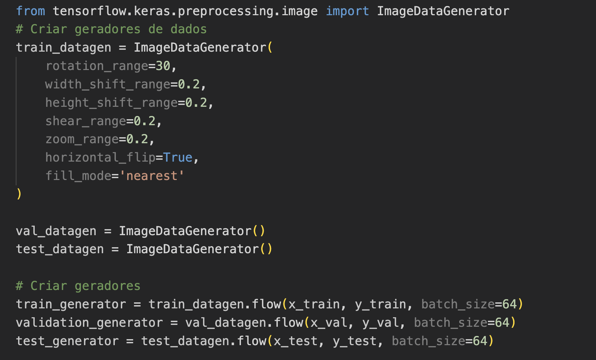
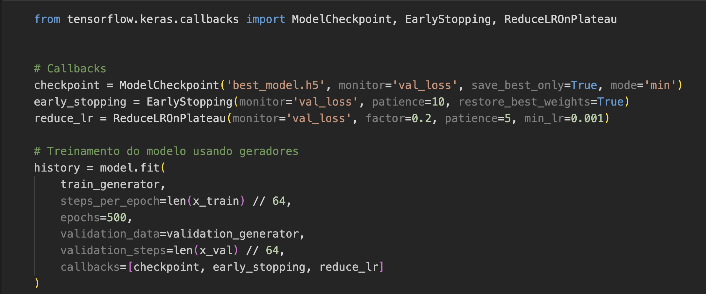

## Detecção de Expressões Faciais

Nesta atividade vamos realizar o treinamento de um classificador de 7 expressões faciais do dataset `FER2013`. O objetivo é reconhecer automaticamente diferentes emoções humanas a partir de imagens.


- angry, disgust, fear, happiness, sad, surprise, neutral
- Imagens 48×48 pixels em escala de cinza
- ~35k imagens de treinamento, ~4k validação, ~4k teste


## 2. Visão Geral do Pipeline

```
Dataset FER2013 → Pré-processamento → Data Augmentation → CNN → Treinamento → Avaliação → Modelo Final
```

## Estrutura dos Dados

O dataset está em CSV e possui a seguinte estrutura:
- `emotion`: classe (0-6)
- `pixels`: string com 2304 valores (48×48 pixels)
- `Usage`: Training/PublicTest/PrivateTest


## Atividades Práticas

Faça o downlod dos arquivos desse projeto:

  - **[Notebook da implementação](detecta_emocao.ipynb)**
  - **[Script Python](detecta_emocao.py)** para execução em tempo real com webcam
  - **[Modelo treinado](best_model.h5)** Rede treinada para inferência

## Destaque para alguns pontos importantes: 


### Data Augmentation




### Callbacks



