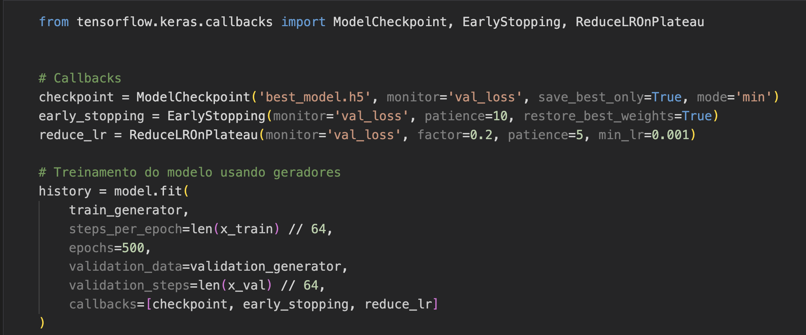

## Classificação Cifar-100

Nesta atividade você deve realizar o treinamento de uma CNN usando as técnicas de `Data Augmentation` e `Callbacks` (EarlyStopping, ModelCheckpoint, etc.). 


## Dataset

Usaremos o CIFAR-100 (32×32 RGB) com 100 classes.

Carregamento direto via `keras.datasets.cifar100`:

```python
from keras.datasets import cifar100

# carrega o dataset com 100 classes
(x_train, y_train), (x_test, y_test) = cifar100.load_data(label_mode="fine")

# Normalização 0–1
x_train = x_train.astype("float32") / 255.0
x_test  = x_test.astype("float32") / 255.0
num_classes = 100

```

## Visão Geral do Pipeline

```
Dataset → Pré-processamento → Data Augmentation → CNN → Treinamento → Avaliação → Modelo Final
```

- Normalizar imagens para [0,1].
- Saída: rótulos inteiros 0..99 (usaremos sparse_categorical_crossentropy).

## Destaque para alguns pontos importantes: 

### Data Augmentation

Exemplo de data augmentation: Lembre-se de usar aumentos leves, adequados a objetos naturais.


### Callbacks

Exemplo de Callback




## Entregáveis

- Notebook com pipeline completo (pré-processamento, modelo, gráficos de treino/val).
- models/best_cifar100.h5 salvo via `ModelCheckpoint`.