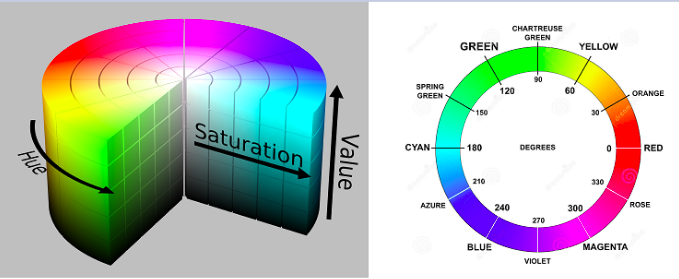

# Quiz Lab05 - Espaço de Cor e Contornos

Este quiz aborda os conceitos de espaço de cor HSV, máscaras, detecção de contornos, cálculo de centro de massa, e operações de desenho em imagens utilizando OpenCV.

## Questões Teóricas

### 1. O que representa o componente H no espaço de cores HSV?
a) Brilho (Brightness)
b) Saturação (Saturation)
c) Matiz (Hue)
d) Valor (Value)



### 2. Qual a principal vantagem do espaço de cor HSV em relação ao RGB para segmentação de cores?
a) É mais rápido para processar
b) Separa a informação de cor (matiz) da intensidade
c) Utiliza menos memória
d) Tem melhor representação de cores escuras

### 3. Na OpenCV, qual é o intervalo de valores para o componente H (matiz) no espaço HSV?
a) 0 a 100
b) 0 a 255
c) 0 a 179
d) 0 a 360

### 4. O que é uma máscara binária no contexto de processamento de imagens?
a) Uma imagem que contém apenas pixels pretos e brancos
b) Um filtro que aplica efeitos artísticos
c) Um algoritmo para compressão de imagens
d) Uma técnica para reduzir ruído

### 5. Qual função da OpenCV é utilizada para encontrar contornos em uma imagem?
a) cv2.findEdges()
b) cv2.detectContours()
c) cv2.findContours()
d) cv2.getContours()

## Questões Práticas

### 6. Observe a imagem abaixo. Qual seria a melhor abordagem para detectar apenas o objeto vermelho?


a) Aplicar um filtro de suavização e depois detecção de bordas
b) Converter para HSV e criar uma máscara para a faixa de vermelho
c) Usar apenas o canal R do RGB e aplicar um limiar
d) Converter para escala de cinza e aplicar limiarização adaptativa

### 7. Para calcular o centro de massa de um contorno detectado, qual método da OpenCV é utilizado?
a) cv2.contourCenter()
b) cv2.moments()
c) cv2.centerOfMass()
d) cv2.contourCentroid()

### 8. Qual é o resultado da seguinte operação?
```python
img = cv2.imread('imagem.png')
hsv = cv2.cvtColor(img, cv2.COLOR_BGR2HSV)
lower_blue = np.array([110, 50, 50])
upper_blue = np.array([130, 255, 255])
mask = cv2.inRange(hsv, lower_blue, upper_blue)
```

a) Conversão da imagem para tons de cinza
b) Criação de uma máscara que isola pixels azuis
c) Aplicação de um filtro de suavização
d) Detecção de bordas na imagem

### 9. Observe a imagem abaixo com contornos detectados. Qual função foi usada para desenhar estes contornos?


a) cv2.rectangle()
b) cv2.line()
c) cv2.drawContours()
d) cv2.circle()

### 10. Para desenhar um círculo no centro de massa de um contorno, qual sequência de funções deve ser usada?
a) cv2.moments(), cálculo do centroide, cv2.circle()
b) cv2.findContours(), cv2.boundingRect(), cv2.rectangle()
c) cv2.Canny(), cv2.HoughCircles(), cv2.circle()
d) cv2.findContours(), cv2.approxPolyDP(), cv2.polylines()

## Questões de Desafio

### 11. Observe a imagem abaixo. Que técnica foi utilizada para segmentar apenas a parte vermelha da melancia?


a) Limiarização simples em escala de cinza
b) Segmentação no espaço de cor HSV
c) Detecção de bordas seguida de preenchimento
d) Subtração de fundo

### 12. Qual é a diferença entre cv2.CHAIN_APPROX_SIMPLE e cv2.CHAIN_APPROX_NONE no contexto da função cv2.findContours()?
a) CHAIN_APPROX_SIMPLE armazena apenas os pontos extremos, enquanto CHAIN_APPROX_NONE armazena todos os pontos do contorno
b) CHAIN_APPROX_SIMPLE é mais preciso, enquanto CHAIN_APPROX_NONE é mais rápido
c) CHAIN_APPROX_SIMPLE funciona apenas com formas simples, enquanto CHAIN_APPROX_NONE funciona com qualquer forma
d) CHAIN_APPROX_SIMPLE detecta apenas contornos externos, enquanto CHAIN_APPROX_NONE detecta todos os contornos

### 13. Ao utilizar a função cv2.findContours(), qual é o significado do parâmetro de hierarquia retornado?
a) Indica o tamanho relativo dos contornos
b) Representa a relação pai-filho entre contornos (contornos dentro de outros)
c) Determina a ordem em que os contornos foram detectados
d) Indica a profundidade de cor dos contornos

### 14. Observe a imagem abaixo. Como você identificaria apenas o pinguim Tux, ignorando o fundo branco?


a) Aplicar detecção de bordas com Canny e preencher o interior
b) Usar segmentação por watershed
c) Converter para HSV e criar uma máscara para cores não-brancas
d) Aplicar limiarização adaptativa seguida de operações morfológicas

### 15. Qual técnica seria mais adequada para detectar e contar os quadrados em uma imagem de um tabuleiro de sudoku?


a) Transformada de Hough para linhas
b) Detecção de contornos seguida de aproximação poligonal
c) Template matching com um modelo de quadrado
d) Segmentação baseada em cor

## Respostas

1. c) Matiz (Hue)
2. b) Separa a informação de cor (matiz) da intensidade
3. c) 0 a 179
4. a) Uma imagem que contém apenas pixels pretos e brancos
5. c) cv2.findContours()
6. b) Converter para HSV e criar uma máscara para a faixa de vermelho
7. b) cv2.moments()
8. b) Criação de uma máscara que isola pixels azuis
9. c) cv2.drawContours()
10. a) cv2.moments(), cálculo do centroide, cv2.circle()
11. b) Segmentação no espaço de cor HSV
12. a) CHAIN_APPROX_SIMPLE armazena apenas os pontos extremos, enquanto CHAIN_APPROX_NONE armazena todos os pontos do contorno
13. b) Representa a relação pai-filho entre contornos (contornos dentro de outros)
14. c) Converter para HSV e criar uma máscara para cores não-brancas
15. b) Detecção de contornos seguida de aproximação poligonal
