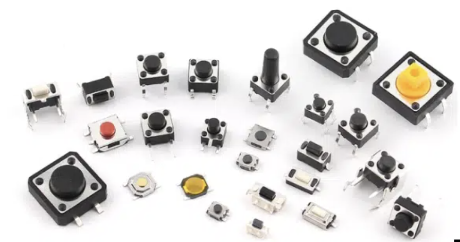

## Introdução à Eletricidade Básica

A eletrônica é o ramo da física que estuda o fluxo de elétrons em materiais semicondutores, condutores e isolantes. Compreender os conceitos fundamentais de eletricidade é essencial para o desenvolvimento de circuitos e sistemas eletrônicos.

### Conceitos Fundamentais

- **Carga Elétrica (\( Q \))**: Propriedade das partículas que determina as interações eletromagnéticas. Medida em coulombs (C).
- **Corrente Elétrica (\( I \))**: Fluxo de cargas elétricas através de um condutor. Medida em amperes (A).
  
  $$
  I = \frac{dQ}{dt}
  $$

- **Tensão Elétrica (Diferença de Potencial, \( V \))**: Energia potencial elétrica por unidade de carga. Medida em volts (V).
- **Resistência Elétrica (\( R \))**: Oposição ao fluxo de corrente em um material. Medida em ohms (Ω).

### Lei de Ohm

A relação entre tensão, corrente e resistência é dada pela Lei de Ohm:

$$
V = R \times I
$$

Onde:

- \( V \): Tensão em volts (V)
- \( I \): Corrente em amperes (A)
- \( R \): Resistência em ohms (Ω)

---

## Simuladores Eletrônicos

Os simuladores eletrônicos são ferramentas essenciais para projetar, testar e validar circuitos antes da montagem física. Eles permitem economizar tempo e recursos, identificando possíveis problemas antecipadamente.

### Principais Simuladores

- **Wokwi**: Simulador online gratuito que permite simular microcontroladores como Arduino, ESP32 e Raspberry Pi Pico, além de diversos componentes eletrônicos.

  [Wokwi - Simulador Online](https://wokwi.com/)

- **SimulIDE**: Simulador offline em tempo real para eletrônica, microcontroladores e Arduino. É uma ferramenta leve que oferece simulação de circuitos analógicos e digitais.

  [Site Oficial do SimulIDE](https://www.simulide.com/p/home.html)

- **SPICE (Simulation Program with Integrated Circuit Emphasis)**: Um padrão da indústria para simulação de circuitos analógicos e digitais.

  - **LTspice**: Gratuito, oferecido pela Analog Devices.
    [Download LTspice](https://www.analog.com/en/design-center/design-tools-and-calculators/ltspice-simulator.html)

- **Proteus**: Software que combina simulação de circuitos com simulação de microcontroladores.

  [Site Oficial do Proteus](https://www.labcenter.com/)

- **Tinkercad Circuits**: Simulador online gratuito, ideal para iniciantes.

  [Tinkercad Circuits](https://www.tinkercad.com/circuits)

### Vantagens do Uso de Simuladores

- **Economia de Recursos**: Evita desperdício de componentes e materiais.
- **Segurança**: Permite testar circuitos sem risco de danos físicos.
- **Análise Detalhada**: Possibilidade de visualizar formas de onda, correntes e tensões em diferentes pontos do circuito.
- **Iteração Rápida**: Facilita modificações e otimizações no projeto.

---

## Protoboard

A **protoboard** é uma plataforma de prototipagem sem solda utilizada em eletrônica para montar circuitos temporários e testar configurações antes da implementação final. Sua estrutura interna é composta por trilhas condutoras de metal organizadas em linhas e colunas, permitindo conexões rápidas e reconfiguráveis entre componentes.

### Estrutura Interna

- **Barramentos de Alimentação**: Localizados nas extremidades da protoboard, esses barramentos são utilizados para distribuir as tensões de alimentação e terra (GND) ao longo da placa. É comum que sejam separados no meio, exigindo pontes de conexão para continuidade elétrica.
- **Áreas de Conexão**: No centro, a protoboard possui grupos de cinco furos conectados eletricamente em colunas, permitindo a inserção de terminais de componentes e jumpers para interligação.

### Boas Práticas de Utilização

- **Organização dos Componentes**: Posicione os componentes de maneira lógica para minimizar o comprimento dos jumpers e reduzir interferências eletromagnéticas. Componentes similares devem ser agrupados para facilitar a análise do circuito.
- **Integridade das Conexões**: Utilize jumpers de qualidade e evite a inserção excessiva de componentes nos mesmos pontos para prevenir desgaste dos contatos internos, que pode levar a mau funcionamento devido a conexões intermitentes.
- **Desacoplamento de Alimentação**: Em circuitos com componentes sensíveis ou de alta velocidade, adicione capacitores de desacoplamento próximos aos pinos de alimentação dos CI's para reduzir ruídos e instabilidades causadas por flutuações na tensão de alimentação.
- **Limitações**: Evite utilizar a protoboard para circuitos de alta frequência ou correntes elevadas, pois a indutância e capacitância parasitas podem afetar o desempenho do circuito.

!!!tip
    Para um guia detalhado sobre a utilização eficiente da protoboard, consulte: [https://portal.vidadesilicio.com.br/protoboard/](https://portal.vidadesilicio.com.br/protoboard/)

---
## Chaves e Botões

**Chaves** e **botões** são componentes eletromecânicos utilizados para controlar o fluxo de corrente em um circuito, funcionando como dispositivos de entrada em sistemas digitais.

### Considerações Técnicas

- **Tipos de Chaves**: Existem diversos tipos, como SPST (Single Pole Single Throw), SPDT (Single Pole Double Throw), DPDT (Double Pole Double Throw), cada um adequado para aplicações específicas conforme a necessidade de contatos e configurações de circuito.
- **Debouncing**: Devido às características mecânicas, ao acionar uma chave ou botão, podem ocorrer múltiplos contatos rápidos (bounce), gerando ruídos no sinal. É importante implementar técnicas de debouncing, seja por hardware (capacitores, resistores) ou software (algoritmos de filtragem), para garantir a estabilidade do sinal de entrada.
- **Pull-up e Pull-down Resistores**: Utilizados para definir um nível lógico definido quando a chave está aberta, prevenindo estados flutuantes que podem causar comportamento indeterminado no circuito digital.

!!!tip
    Para aprofundar-se no tema de chaves e botões, acesse: [https://www.robocore.net/tutoriais/introducao-a-chaves-e-botoes](https://www.robocore.net/tutoriais/introducao-a-chaves-e-botoes)

---
## LEDs 

Os **LEDs (Light Emitting Diodes)** são dispositivos semicondutores que emitem luz quando polarizados diretamente. São utilizados nas mais diversas aplicações do nosso dia-a-dia como indicadores luminosos em circuitos eletrônicos.

### Características e Utilização

- **Polaridade**: LEDs possuem anodo (+) e catodo (-). A corrente deve fluir do anodo para o catodo; a inversão de polaridade impede a condução e pode danificar o componente.
- **Tensão e Corrente**: Cada LED possui uma tensão direta (\( V_{LED} \)) específica, geralmente entre 1,8V e 3,3V, e uma corrente nominal (\( I_{LED} \)), tipicamente 10mA a 20mA.

### Cálculo do Resistor Limitador

Para limitar a corrente e proteger o LED, calcula-se o resistor em série:

$$
R = \frac{V_{fonte} - V_{LED}}{I_{LED}}
$$

Onde:

- $V_{\text{fonte}}$: Tensão da fonte de alimentação.
- $V_{\text{LED}}$: Queda de tensão no LED.
- $I_{\text{LED}}$: Corrente desejada através do LED.

**Exemplo**: Para um LED com $V_{\text{LED}} = 2V$ alimentado por uma fonte de 5V e corrente de 15mA:

$$
R = \frac{5V - 2V}{15mA} = 200\ \Omega
$$

Nesse caso o valor comercial é $R = 220\ \Omega$.

### Aplicações Avançadas

- **Controle por PWM**: A modulação por largura de pulso permite controlar a intensidade luminosa do LED, variando o ciclo de trabalho do sinal de controle.
- **Multiplexação**: Em sistemas com múltiplos LEDs, a multiplexação permite controlar vários LEDs com menos pinos do microcontrolador, acionando-os em sequências rápidas para criar a ilusão de iluminação contínua.
- **Matrizes de LEDs**: Utilizadas em displays e painéis, exigem técnicas específicas de controle, como varredura de linhas e colunas, e cuidados com corrente total e dissipação de calor.

!!!tip
    Para mais detalhes sobre LEDs e circuitos associados, visite: [https://www.makerhero.com/blog/aprenda-a-piscar-um-led-com-arduino/](https://www.makerhero.com/blog/aprenda-a-piscar-um-led-com-arduino/)

---
## Sensores e Atuadores

Os **sensores** são dispositivos que detectam eventos ou mudanças no ambiente físico e fornecem uma saída correspondente, geralmente sob a forma de um sinal elétrico. **Atuadores** convertem sinais elétricos em ação física, permitindo ao sistema interagir com o ambiente.

### Sensores

- **Tipos Comuns**:
  - **Temperatura**: Termistores, termopares, sensores digitais (DS18B20).
  - **Luminosidade**: Fotoresistores (LDR), fotodiodos, fototransistores.
  - **Umidade**: Sensores capacitivos e resistivos.
  - **Pressão**: Sensores piezorresistivos, piezoelétricos.

### Atuadores

- **Tipos Comuns**:
  - **Motores DC**: Conversão de energia elétrica em movimento rotacional; requerem circuitos de controle como pontes H para reversão de sentido.
  - **Servomotores**: Oferecem controle preciso de posição angular; controlados via sinal PWM específico.
  - **Relés**: Permitem o acionamento de cargas de alta potência isolando o circuito de controle.
  - **Buzzer**: Dispositivos piezoelétricos utilizados para gerar som; podem ser controlados por sinais digitais ou analógicos.

