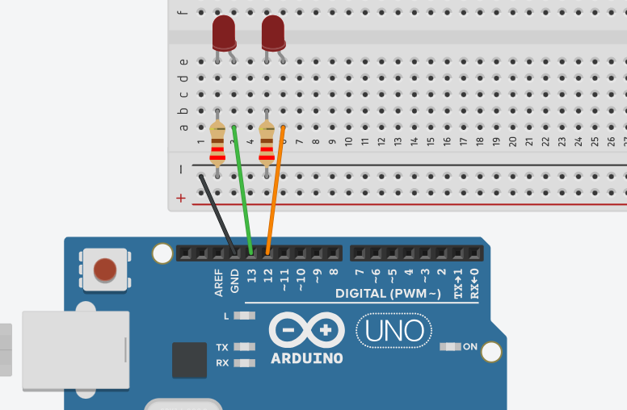
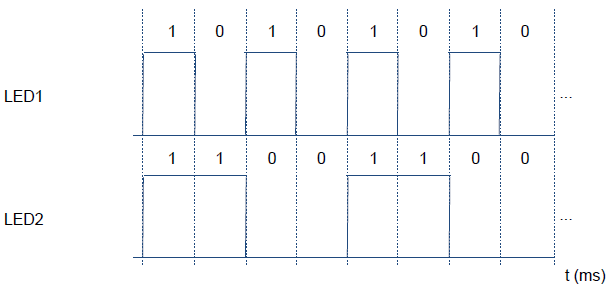
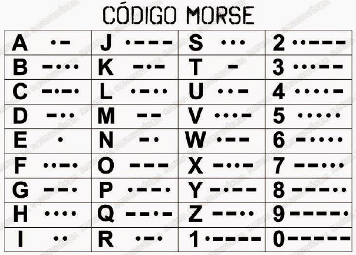

## Introdução ao Arduino e Controle de LEDs

### Visão Geral
Neste laboratório, você irá aprender os conceitos básicos do Arduino realizando experimentos com LEDs e um buzzer. Os desafios propostos ajudarão você a compreender os fundamentos de programação do Arduino, controle de pinos digitais e temporização.


### Desafio 1: Controle Básico de LEDs

**Objetivo**: Criar um circuito com dois LEDs que piscam sincronizadamente.

#### Instruções:
1. Monte o circuito conforme mostrado na imagem abaixo:
   

2. Conecte:
   - LED 1 ao pino digital 13
   - LED 2 ao pino digital 12
   
3. Escreva um código que faça os LEDs piscarem simultaneamente com um intervalo de 0,5 segundos.

#### Dicas:
- Use as funções `digitalWrite()` para controlar os LEDs
- Use `delay()` para controlar o tempo entre os estados
- Lembre-se de configurar os pinos como saída usando `pinMode()`

### Desafio 2: Sequência de LEDs

**Objetivo**: Controlar dois LEDs seguindo uma sequência temporal específica.

#### Instruções:
1. Use o mesmo circuito do Desafio 1.

2. Programe os LEDs para acenderem conforme a carta de tempo abaixo:
   

   Onde:
   - 1 = nível lógico alto (HIGH) - LED aceso
   - 0 = nível lógico baixo (LOW) - LED apagado
   - Cada intervalo = 500ms (meio segundo)

#### Dicas:
- Observe cuidadosamente o padrão e organize seu código de forma lógica
- A sequência deve ser repetida continuamente

### Desafio 3: Código Morse com Buzzer

**Objetivo**: Criar um sistema que reproduza seu nome em código Morse usando um buzzer.

#### Instruções:
1. Monte um circuito adicionando um buzzer piezoelétrico ao seu Arduino.
   - Conecte o terminal positivo do buzzer a um pino digital (sugestão: pino 8)
   - Conecte o terminal negativo ao GND

2. Usando a tabela de código Morse abaixo, programe o Arduino para reproduzir seu nome:
   

#### Convenções do Código Morse:
- Ponto (•): tom curto (200ms)
- Traço (−): tom longo (600ms)
- Espaço entre símbolos de uma mesma letra: pausa curta (200ms)
- Espaço entre letras: pausa média (600ms)
- Espaço entre palavras: pausa longa (1400ms)

#### Dicas:
- Use a função `tone()` para gerar sons no buzzer
- Use a função `noTone()` para silenciar o buzzer
- Considere criar funções auxiliares para representar pontos e traços

## Programação com millis() - Temporização Avançada sem Bloqueio

### Conceitos Teóricos

A função `delay()` é simples de usar, mas apresenta uma limitação fundamental: ela **bloqueia** a execução do programa, impedindo que o Arduino faça qualquer outra coisa durante a espera. Isso torna impossível realizar múltiplas tarefas simultaneamente, como:

- Monitorar botões enquanto LEDs piscam
- Ler sensores em intervalos regulares enquanto atualiza um display
- Controlar múltiplos dispositivos com diferentes tempos de atualização

A função `millis()` oferece uma solução para esse problema:

- Retorna o número de milissegundos desde que o programa iniciou (contador sempre crescente)
- Permite criar temporizadores não-bloqueantes
- Possibilita executar várias tarefas "simultaneamente" (multitarefa cooperativa)

### Implementação Prática

Para implementar um temporizador com `millis()`:

1. Armazene o valor atual de `millis()` como um ponto de referência
2. Em cada loop, compare o valor atual de `millis()` com sua referência
3. Execute uma ação quando a diferença atingir ou ultrapassar o intervalo desejado
4. Atualize sua referência para o próximo intervalo

Exemplo básico para piscar um LED a cada segundo sem bloquear o programa:

```cpp
const int ledPin = 13;
unsigned long previousMillis = 0;  // Último momento em que o LED foi atualizado
const long interval = 1000;        // Intervalo em milissegundos (1 segundo)
int ledState = LOW;                // Estado atual do LED

void setup() {
  pinMode(ledPin, OUTPUT);
}

void loop() {
  // Captura o tempo atual em milissegundos
  unsigned long currentMillis = millis();

  // Verifica se é hora de atualizar o LED
  if (currentMillis - previousMillis >= interval) {
    // Salva o último momento em que atualizamos o LED
    previousMillis = currentMillis;

    // Se o LED está desligado, ligue-o e vice-versa
    if (ledState == LOW) {
      ledState = HIGH;
    } else {
      ledState = LOW;
    }

    // Atualiza o LED com seu novo estado
    digitalWrite(ledPin, ledState);
  }
  
  // Aqui você pode realizar outras tarefas sem ser bloqueado!
  // Por exemplo, ler sensores, verificar botões, etc.
}
```

### Vantagens do millis()

1. **Multitarefa**: Permite controlar vários dispositivos com diferentes intervalos de tempo
2. **Responsividade**: O programa continua respondendo a entradas mesmo durante temporizações
3. **Flexibilidade**: Possibilita implementar temporizadores complexos e padrões de temporização
4. **Eficiência**: Melhor utilização do processador, executando tarefas enquanto "espera"

### Limitações do millis()

1. O contador volta a zero após aproximadamente 50 dias de execução contínua (estouro)
2. Código um pouco mais complexo que usando `delay()`
3. Requer variáveis adicionais para rastrear os tempos

## Desafio 4: LED Piscante com millis()

**Objetivo**: Recriar o Desafio 1 usando `millis()` em vez de `delay()`.

### Instruções:
1. Use o mesmo circuito do Desafio 1.
2. Modifique seu código para utilizar `millis()` para temporização não-bloqueante.
3. Adicione as seguintes funcionalidades:
   - LED 1 deve piscar a cada 500ms
   - LED 2 deve piscar a cada 1000ms
   - Os LEDs devem funcionar independentemente (em frequências diferentes)

### Dicas:
- Crie variáveis separadas para rastrear o tempo de cada LED
- Não use `delay()` em nenhuma parte do código
- Estruture seu código de forma a permitir adicionar mais funcionalidades no futuro

## Desafio 5: Sistema Multi-tarefa

**Objetivo**: Criar um sistema que realize três tarefas simultaneamente, usando `millis()` para temporização.

### Instruções:
1. Monte um circuito com dois LEDs e um buzzer.
2. Programe o sistema para realizar as seguintes tarefas:
   - LED 1: Pisca a cada 1 segundo
   - LED 2: Sequência específica (2 segundos aceso, 1 segundo apagado)
   - Buzzer: Reproduz um bipe curto a cada 5 segundos

### Dicas:
- Use `millis()` para toda a temporização
- Organize seu código com funções separadas para cada tarefa
- Pense em como estruturar seu programa para facilitar a adição de novas tarefas no futuro
