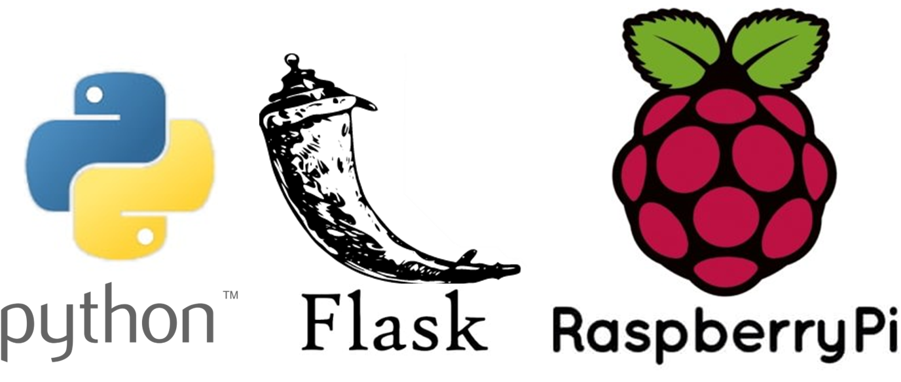

## O que vamos ver neste lab?

- Configurar um servidor web Flask na Raspberry Pi.
- Controlar um LED através de uma interface web.
- Compreender os conceitos básicos de programação GPIO com a Raspberry Pi.


## Montando um Webserver em Flask

Vamos montar um webserver na raspberry pi com flask. A ideia deste exemplo é controlar por um navegador web o status de um led entre ligado e desligado:


### Instalando o Flask e configurando o ambiente


!!! warning 
    Ligue a Raspberry PI, faça o acesso SSH e certifique que está com acesso a internet. 


No terminal da raspberry pi, atualize os repositórios:

```bash

sudo apt update

```   

Instale os pacotes do flask

```bash

sudo apt-get install python3-flask

```   

Agora vamos criar nossa arvore de projeto:

``` shell
- webserver
    - static
        - index.css
    - templates
        - index.html
    - app.py
```
onde: 

- webserver: diretório principal do projeto.
    - static: diretório para arquivos estáticos.
        - index.css: arquivo de estilos CSS para a interface web.
    - templates: diretório para arquivos HTML.
        - index.html: arquivo HTML principal da aplicação.
    - app.py: script Python que contém a lógica do servidor Flask e a programação GPIO.
    

No terminal da Raspberry PI, crie a estrutura de diretórios:

```bash
cd ~
mkdir webserver
cd webserver
mkdir static templates
ls
``` 

!!! exercise 
    O comando `ls` lista os arquivos e diretórios no diretório atual. Leia a saida do terminal e verifique se os diretorios foram criados corretamente.
 


### Vamos criar o ``app.py``.

No terminal da Raspberry PI, digite:

```bash

nano app.py

```  

Com o editor nano aberto, insira o seguinte código:

```python
'''
	Servidor web com flask para controle de um LED.
'''
import RPi.GPIO as GPIO
from flask import Flask, render_template, request

app = Flask(__name__)

GPIO.setmode(GPIO.BCM)
GPIO.setwarnings(False)

# Define o pino GPIO para o LED
ledRed = 2

# Inicializa o status do LED como desligado
ledRedSts = 0

# Define o pino do LED como saída
GPIO.setup(ledRed, GPIO.OUT)   

# Desliga o LED inicialmente
GPIO.output(ledRed, GPIO.LOW)
	
@app.route("/")
def index():
	# Lê o status do GPIO
	ledRedSts = GPIO.input(ledRed)

	templateData = {
      		'ledRed'  : ledRedSts,
      	}
	return render_template('index.html', **templateData)
	
@app.route("/<deviceName>/<action>")
def action(deviceName, action):
	if deviceName == 'ledRed':
		actuator = ledRed
   
	if action == "on":
		GPIO.output(actuator, GPIO.HIGH)
	if action == "off":
		GPIO.output(actuator, GPIO.LOW)
		     
	ledRedSts = GPIO.input(ledRed)
   
	templateData = {
      		'ledRed'  : ledRedSts,
	}
	return render_template('index.html', **templateData)

if __name__ == "__main__":
   app.run(host='0.0.0.0', port=80, debug=True)

```  


**Shooooooowwwwww!** Não esqueça de Salvar e fechar o editor nano. Ctrl+X >> Y


### Vamos criar a pagina html ``index.html``. 

No terminal da Raspberry Pi, navegue até o diretório `templates` e crie o arquivo `index.html`:

```bash
cd templates
nano index.html

```  

Insira o seguinte código:

```html
<!DOCTYPE html>
   <head>
      <title>Webserver</title>
      <link rel="stylesheet" href='../static/index.css'/>
   </head>

   <body>

		<h2> Controle LED </h2>
		
		<h3> RED LED ==>  {{ ledRed  }}  ==>  
			
				<a href="/ledRed/off"class="button">TURN OFF</a>
			
				<a href="/ledRed/on" class="button">TURN ON</a> 
				
		</h3>
		
   </body>
</html>

```

**Shooooooowwwwww!** Não esqueça de Salvar e fechar o editor nano. Ctrl+X >> Y


### Vamos criar o arquivo de estilo css ``index.css``. 

No terminal da Raspberry Pi, navegue até o diretório `static` e crie o arquivo `index.css`:

```bash
cd ..
cd static
nano index.html

```  
> Com o editor nano aberto digite:

```css

body {
   background: blue;
   color: yellow;
}

.button {
  font: bold 15px Arial;
  text-decoration: none;
  background-color: #EEEEEE;
  color: #333333;
  padding: 2px 6px 2px 6px;
  border-collapse: separete;
  border-spacing: 0;
  border-top: 1px solid #CCCCCC;
  border-right: 1px solid #333333;
  border-bottom: 1px solid #333333;
  border-left: 1px solid #CCCCCC;
}

```

**Shooooooowwwwww!** Não esqueça de Salvar e fechar o editor nano. Ctrl+X >> Y


### Hora de testar

Vamos testar nosso webserver simples.

No terminal da Raspberry Pi, retorne ao diretório principal e execute o script:

```bash
cd ..
sudo python app.py

```  


> Deixe o Flask rodando na Raspberry Pi. Em um computador ou smartphone (que deve estar na mesma rede da Raspberry Pi), abra um navegador web e digite o IP da Raspberry Pi. Para encontrar o IP da Raspberry Pi, você pode usar o comando:

```bash

hostname -I

```  
!!! warning
    O resultado esperado é abrir uma página web onde você pode controlar o LED.

 

## Desafios
    
Agora que já entendemos a estrutura básica do webserver em Python, faça os `Desafios` abaixo.


!!! exercise
    Compreenda o código app.py e monte o circuito adequado para conseguir visualizar o led acender e apagar.

 
!!! exercise
    Altere o código app.py e adicione mais 2 led e 2 botões (totalizando 3 leds, 2 botões), lembre-se de adaptar os arquivos HTML para exibir os status no frontend. 


!!! exercise
    Utilize seus conhecimentos web e proponha melhorias de UI/UX para o exercício anterior. Explore bibliotecas CSS como Bootstrap ou Materialize para aprimorar a interface.
    

