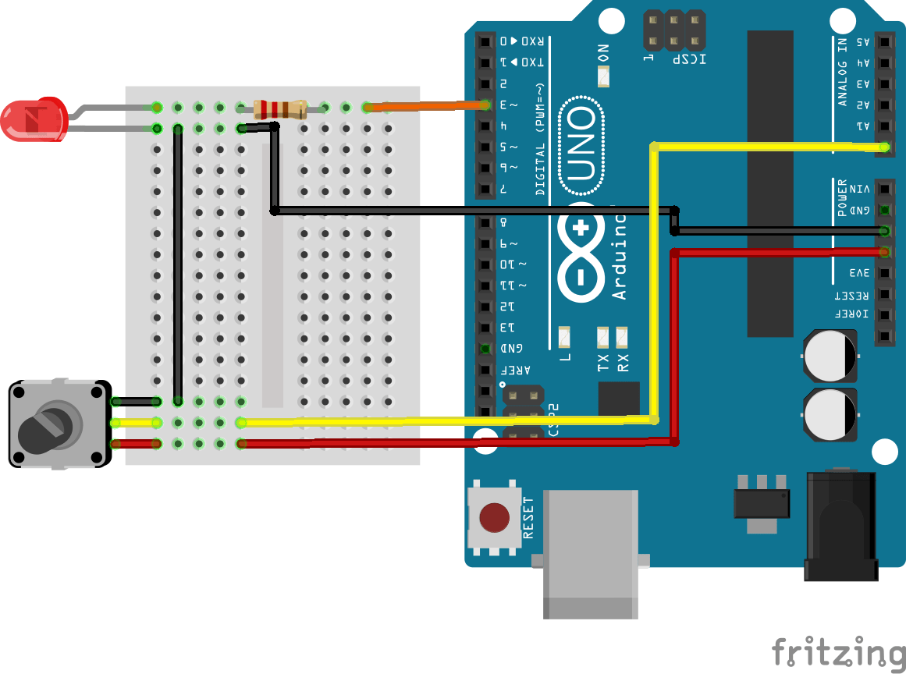
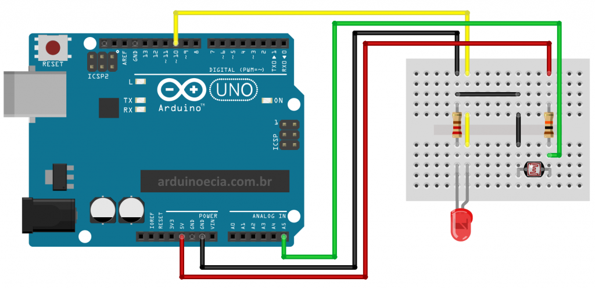

## Laboratório 3 - Entradas Analógicas e Controle PWM

## Conceitos Fundamentais

### Entradas Analógicas
Enquanto entradas digitais leem apenas dois estados (HIGH ou LOW), as entradas analógicas podem detectar uma faixa contínua de valores de tensão, convertendo-os em valores digitais entre 0 e 1023 (resolução de 10 bits).

- Arduino Uno e similares: 6 pinos de entrada analógica (A0 a A5)
- Tensão de referência padrão: 5V (pode ser alterada)
- Aplicações típicas: Leitura de sensores de temperatura, luz, pressão, distância, etc.

### Função analogRead()
```cpp
int valorSensor = analogRead(A0); // Lê valor entre 0 e 1023
```

### Saídas PWM (Pulse Width Modulation)
O PWM é uma técnica que simula uma saída analógica através de pulsos digitais com largura variável. Quanto maior o ciclo de trabalho (duty cycle), maior a média da tensão de saída.

- Arduino Uno: 6 pinos com capacidade PWM (geralmente marcados com ~)
- Resolução: 8 bits (valores entre 0 e 255)
- Aplicações típicas: Controle de intensidade de LEDs, velocidade de motores, tons em buzzers

### Função analogWrite()
```cpp
analogWrite(pinoPWM, valor); // valor entre 0 (0%) e 255 (100%)
```

### Função map()
Esta função é extremamente útil para converter valores entre diferentes intervalos:

```cpp
// Converte um valor de um intervalo para outro
int valorConvertido = map(valor, deMenor, deMaior, paraMenor, paraMaior);

// Exemplo: converter valor do potenciômetro (0-1023) para PWM (0-255)
int brilho = map(analogRead(A0), 0, 1023, 0, 255);
```

## Desafio 1: Controle de Brilho com Potenciômetro

**Objetivo**: Usar um potenciômetro para controlar o brilho de um LED através de PWM.

### Instruções:
1. Monte o circuito conforme mostrado na imagem abaixo:
   

2. Conecte:
   - Potenciômetro ao pino analógico A0
   - LED ao pino digital 3 (com capacidade PWM)

3. Implemente um código que:
   - Leia o valor do potenciômetro (0-1023)
   - Converta esse valor para a escala PWM (0-255)
   - Aplique o valor convertido para controlar o brilho do LED

### Código Base:
```cpp
const int potPin = A0;    // Pino do potenciômetro
const int ledPin = 3;     // Pino PWM do LED

int potValue = 0;         // Valor lido do potenciômetro
int ledBrightness = 0;    // Valor de brilho do LED

void setup() {
  pinMode(ledPin, OUTPUT);  // Configura o pino do LED como saída
  Serial.begin(9600);       // Inicia comunicação serial
}

void loop() {
  // Lê o valor do potenciômetro
  potValue = analogRead(potPin);
  
  // Converte o valor do potenciômetro (0-1023) para a escala PWM (0-255)
  ledBrightness = map(potValue, 0, 1023, 0, 255);
  
  // Define o brilho do LED
  analogWrite(ledPin, ledBrightness);
  
  // Exibe os valores no monitor serial
  Serial.print("Potenciômetro: ");
  Serial.print(potValue);
  Serial.print(" | Brilho LED: ");
  Serial.println(ledBrightness);
  
  // Pequeno atraso para estabilizar as leituras
  delay(100);
}
```

### Perguntas para reflexão:
1. O que acontece quando você gira o potenciômetro lentamente? E rapidamente?
2. Como o valor do potenciômetro é convertido para controlar o LED?
3. Qual a diferença entre usar `digitalWrite()` e `analogWrite()` para controlar um LED?

## Desafio 2: Sensor de Luz (LDR) com Indicador Visual

**Objetivo**: Criar um sistema que lê a intensidade de luz ambiente e a representa visualmente com um LED.

### Instruções:
1. Monte o circuito conforme mostrado na imagem abaixo:
   

2. Conecte:
   - LDR e resistor de 10kΩ em divisor de tensão ao pino A5
   - LED ao pino digital 10 (com capacidade PWM)

3. Implemente um código que:
   - Leia o valor do sensor de luz (LDR)
   - Quanto mais escuro o ambiente, mais brilhante o LED deve ficar
   - Quanto mais claro o ambiente, menos brilhante o LED deve ficar

### Dicas:
- O LDR (Light Dependent Resistor) diminui sua resistência quando exposto à luz
- Use a função `map()` de forma inversa para o LED brilhar mais no escuro
- Adicione calibração para adaptar o sistema a diferentes condições de iluminação

### Código Exemplo:
```cpp
const int ldrPin = A5;      // Pino do LDR
const int ledPin = 10;      // Pino PWM do LED

int ldrValue = 0;           // Valor lido do LDR
int ledBrightness = 0;      // Valor de brilho do LED
int minLight = 1023;        // Valor mínimo de luz (ajustado na calibração)
int maxLight = 0;           // Valor máximo de luz (ajustado na calibração)
bool calibrated = false;    // Indica se a calibração foi realizada

void setup() {
  pinMode(ledPin, OUTPUT);  // Configura o pino do LED como saída
  Serial.begin(9600);       // Inicia comunicação serial
  
  Serial.println("Sensor de luz com indicador visual");
  Serial.println("Calibrando o sensor por 5 segundos...");
  
  // Calibração do sensor de luz durante 5 segundos
  unsigned long startTime = millis();
  while (millis() - startTime < 5000) {
    ldrValue = analogRead(ldrPin);
    
    // Atualiza os valores mínimo e máximo
    if (ldrValue < minLight) minLight = ldrValue;
    if (ldrValue > maxLight) maxLight = ldrValue;
    
    delay(100);
  }
  
  calibrated = true;
  Serial.print("Calibração concluída! Faixa: ");
  Serial.print(minLight);
  Serial.print(" a ");
  Serial.println(maxLight);
}

void loop() {
  // Lê o valor do sensor de luz
  ldrValue = analogRead(ldrPin);
  
  // Se calibrado, mapeia o valor do LDR para o brilho do LED
  if (calibrated) {
    // Inverte o mapeamento para o LED brilhar mais no escuro
    ledBrightness = map(ldrValue, minLight, maxLight, 255, 0);
    
    // Restringe o valor entre 0 e 255
    ledBrightness = constrain(ledBrightness, 0, 255);
  }
  else {
    ledBrightness = 0;  // Se não calibrado, mantém o LED desligado
  }
  
  // Define o brilho do LED
  analogWrite(ledPin, ledBrightness);
  
  // Exibe os valores no monitor serial
  Serial.print("Luz ambiente: ");
  Serial.print(ldrValue);
  Serial.print(" | Brilho LED: ");
  Serial.println(ledBrightness);
  
  delay(100);
}
```

## Desafio 3: Controle Proporcional de Temporização

**Objetivo**: Implementar um sistema onde o potenciômetro controla a velocidade de intermitência de um LED, usando `millis()` para temporização não-bloqueante.

### Instruções:
1. Use o mesmo circuito do Desafio 1.
2. Implemente um código que:
   - Leia o valor do potenciômetro
   - Converta esse valor para um intervalo de tempo (100ms a 2000ms)
   - Faça o LED piscar nesse intervalo, sem usar `delay()`
   - Mostre no monitor serial o valor do potenciômetro e o intervalo calculado


## Desafio 4: Theremin Óptico

**Objetivo**: Criar um instrumento musical simples controlado pela luz, onde a intensidade de luz controla a frequência de um som em um buzzer.

### Instruções:
1. Monte um circuito com:
   - LDR conectado ao pino A0
   - Buzzer conectado ao pino 8
   
2. Implemente um código que:
   - Leia o valor do LDR
   - Converta para uma frequência audível (100Hz a 2000Hz)
   - Gere um tom no buzzer correspondente à leitura do LDR
   - Permita "tocar" o instrumento movendo a mão sobre o sensor

### Dicas:
- Use a função `tone(pin, frequency)` para gerar sons no buzzer
- Adicione botões para ligar/desligar o som ou mudar "escalas"
- Experimente adicionar um segundo sensor para controlar volume ou outra característica do som

## Material de Referência
- [Documentação oficial do Arduino sobre analogRead()](https://docs.arduino.cc/language-reference/pt/fun%C3%A7%C3%B5es/analog-io/analogRead/)
- [Documentação oficial do Arduino sobre analogWrite()](https://docs.arduino.cc/language-reference/pt/fun%C3%A7%C3%B5es/analog-io/analogWrite/)
- [Tutorial sobre PWM no Arduino](https://www.arduino.cc/en/Tutorial/PWM)