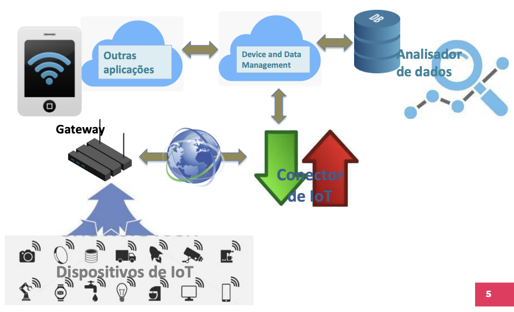
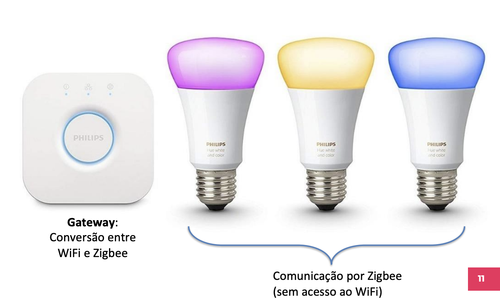

Neste Laboratório vamos trabalhar com Node-red e conhecer o protocolo MQTT.
> - arquivo pdf do laboratório: [laboratório5](slides.pdf)

# Introdução à IoT

## Agenda
- Instalação do Node-RED e primeiros testes
- Montagem de um dashboard no Node-RED
- Criação de um end-point
- Apresentação do MQTT

## Conectando dispositivos a aplicações
Agora que já exploramos as funcionalidades do Arduino e sua capacidade de conectar sensores e atuadores, vamos prosseguir conectando o Arduino a aplicações que fazem uso desse dispositivo.

Em primeiro lugar, vamos relembrar a arquitetura que usaremos para os dispositivos de IoT se conectarem às suas aplicações.

## Arquitetura básica de IoT
A arquitetura de implantação apresentada aqui é um modelo padrão para inspirar projetos reais. Ela inclui os elementos fundamentais para a conectividade, sem detalhar soluções para problemas acessórios.



- **Interoperabilidade**: facilita a compatibilidade entre diferentes projetos de IoT.
- **Modularidade**: define módulos que podem ser criados separadamente ou usados como "off-the-shelf".

## Dispositivos de IoT
Os dispositivos de IoT interagem com o ambiente ao seu redor, capturando dados de sensores ou executando comandos por meio de atuadores.

- Cada funcionalidade no dispositivo pode ser considerada uma aplicação (Endpoint Application).
- Cada aplicação deve ser univocamente endereçável.

## Conector de IoT
Os conectores de IoT gerenciam mensagens que chegam dos dispositivos ou são destinadas a eles, adaptando-as ao protocolo de cada dispositivo.

- Pode haver conectores diferentes para protocolos variados.
- Protocolos comuns em IoT: MQTT, WebSocket, CoAP, LoRaWAN.

## Gerenciamento de dispositivos e dados
Este componente faz o gerenciamento remoto dos dispositivos e de seus dados, autorizando o acesso de outras aplicações.

- Cadastra novos dispositivos e aplicações.
- Monitora a disponibilidade dos dispositivos.
- Envia comandos de gerenciamento, como inicialização, reinicialização, desligamento e atualização de firmware.

## Bancos de dados e análise de dados
Armazena dados provenientes das aplicações e comandos destinados aos dispositivos.

- Bancos de dados NoSQL são mais indicados para a IoT devido à natureza diversificada e em constante mudança dos dados.
- Analisadores de dados monitoram os dados para melhor aproveitamento.

## Gateway
O gateway conecta dispositivos sem acesso direto à internet e realiza a conversão de protocolos entre os dispositivos de IoT e o conector de IoT.




- Gerencia múltiplos protocolos, especialmente em LAN’s, PAN’s e HAN’s (ex: Zigbee, Bluetooth, LoRa, Thread/6LoWPAN).


## Node-RED
O Node-RED é uma plataforma de programação visual para sistemas baseados em eventos. Ele executa como um servidor web e é amplamente utilizado para conectar dispositivos de IoT.

- Programado em Node.js, é uma ferramenta visual para editar fluxos de mensagens.
- Disponível em serviços de Cloud como o IBM Bluemix.

### Instalação do Node-RED
1. Instale o Node.js (versão LTS) no site [Node.js](https://nodejs.org/).
2. No terminal, digite: 
    ```bash
    npm install -g --unsafe-perm node-red
    ```
3. Para rodar o Node-RED: 
    ```bash
    node-red
    ```
4. Acesse no navegador: [http://localhost:1880](http://localhost:1880)

### Primeiro fluxo no Node-RED
- Conecte um nó de entrada do tipo "inject" a um nó "debug", faça o deploy e observe o resultado no painel de debug.
- Modifique o nó "inject" e veja as alterações no resultado.


## Desafios no Node-RED

### Desafio 1: Monitor de clima
1. Cadastre-se no site [OpenWeather](https://openweathermap.org/), crie um token e leia a [documentação da API Current](https://openweathermap.org/current).
2. Crie uma URL para obter o tempo de uma cidade de sua preferência e compare o resultado com a saída no Node-RED.


### Desafio 2: Dashboard
Crie um dashboard que exiba informações de duas ou mais cidades, incluindo:
- Temperatura atual
- Temperatura mínima
- Temperatura máxima
- Velocidade do vento
- Umidade relativa
- Sensação térmica

Atualize os dados a cada 3 ou 5 segundos.


## MQTT (Message Queuing Telemetry Transport)
O MQTT é um protocolo de comunicação leve projetado especificamente para dispositivos com recursos limitados, como sensores e atuadores, e cenários de redes com alta latência e baixa largura de banda. Sua simplicidade e baixo overhead o tornam ideal para a Internet das Coisas (IoT).


### Características principais do MQTT:
- **Modelo Publish/Subscribe**: O MQTT usa um modelo de comunicação assíncrono, onde os clientes se inscrevem (subscribe) em tópicos específicos para receber mensagens e publicam (publish) mensagens nesses tópicos para serem recebidas por outros clientes.
- **Broker**: O broker é o servidor central que gerencia as mensagens publicadas e as distribui para os clientes inscritos em tópicos específicos.
- **Qualidade de Serviço (QoS)**: O MQTT oferece três níveis de QoS que controlam a entrega das mensagens, garantindo diferentes níveis de confiabilidade:
  - **QoS 0 - At most once**: A mensagem é entregue no máximo uma vez, sem confirmação de recebimento. Risco de perda de mensagem.
  - **QoS 1 - At least once**: A mensagem é entregue ao menos uma vez. Há confirmação de recebimento, mas pode ocorrer duplicação de mensagens.
  - **QoS 2 - Exactly once**: A mensagem é entregue exatamente uma vez, garantindo a entrega sem duplicação ou perda, porém com maior overhead.

- **Retained Messages**: Uma mensagem publicada pode ser marcada como "retida", o que significa que o broker armazenará essa última mensagem publicada no tópico e enviará imediatamente aos novos clientes que se inscreverem no tópico, mesmo após a publicação original.
- **Last Will and Testament (LWT)**: O LWT é uma mensagem que o broker envia automaticamente caso um cliente MQTT se desconecte inesperadamente, notificando os outros clientes da rede sobre a falha.


### Funcionamento do MQTT:
1. **Publicação de Mensagens**: Um cliente publica uma mensagem em um tópico específico no broker.
2. **Inscrição em Tópicos**: Outros clientes se inscrevem em tópicos de interesse e, quando uma mensagem é publicada nesses tópicos, o broker a entrega aos inscritos.
3. **Filtragem por Tópicos**: O MQTT utiliza hierarquias de tópicos, permitindo o uso de caracteres coringa para subscrição:
   - **+**: Corresponde a um único nível de um tópico. Exemplo: `sala/+/temperatura` se inscreve em todos os sensores de temperatura de diferentes salas.
   - **#**: Corresponde a todos os níveis subsequentes do tópico. Exemplo: `sala/#` se inscreve em todos os tópicos que começam com "sala".

### Exemplos de Brokers MQTT:
- **Brokers Públicos**:
  - [iot.eclipse.org](https://iot.eclipse.org)
  - [test.mosquitto.org](https://test.mosquitto.org)
  - [dev.rabbitmq.com](https://www.rabbitmq.com)
  - [broker.mqttdashboard.com](https://www.mqtt-dashboard.com)

### Desafio 3: Cliente MQTT no Node-RED

No Node-RED, um fluxo pode ser criado para simular um chat entre dois ou mais clientes MQTT. Para isso, deve-se configurar tópicos que sigam boas práticas de nomeação, como camelCase, e criar dois nós principais:

- Node MQTT In: Subscreva-se a um tópico específico e receba mensagens publicadas nesse tópico.
- Node MQTT Out: Publique mensagens em um tópico que os outros clientes estão escutando.


**Exemplo de configuração:**

- Tópico de envio: `arnaldoAVianaJr/chat/mensagem`
- Para receber mensagens, crie um nó que se inscreva em: arnaldoAVianaJr/#.


!!! tip
    Esse fluxo de comunicação pode ser testado em um ambiente local ou em um dos brokers públicos mencionados anteriormente.
